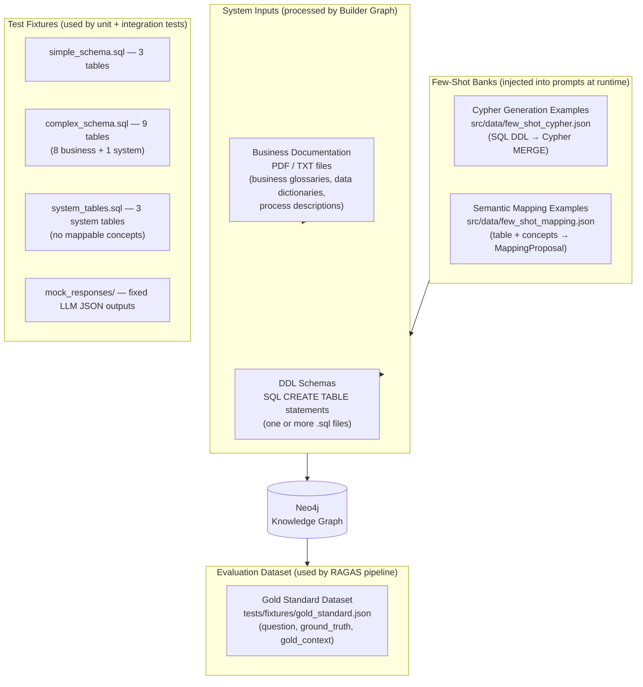

# Dataset Specification

> **Project:** Multi-Agent Framework for Semantic Discovery & GraphRAG
> **Version:** 2.0 — Updated March 2026
> **Companion documents:** [SPECS.md](./SPECS.md), [REQUIREMENTS.md](./REQUIREMENTS.md), [TEST_PLAN.md](./TEST_PLAN.md), [ABLATION.md](./ABLATION.md)
> **Purpose:** Defines ALL datasets used by the system — inputs (PDFs, DDL), few-shot example banks, the gold-standard evaluation dataset, and the six synthetic ablation datasets. An AI coding agent must use these specifications to generate fixture files and seed data.

---

## Table of Contents

1. [Dataset Overview](#1-dataset-overview)
2. [Input Dataset — Business Documentation (PDF)](#2-input-dataset--business-documentation-pdf)
3. [Input Dataset — DDL Schemas](#3-input-dataset--ddl-schemas)
4. [Few-Shot Example Bank — Cypher Generation](#4-few-shot-example-bank--cypher-generation)
5. [Few-Shot Example Bank — Semantic Mapping](#5-few-shot-example-bank--semantic-mapping)
6. [Gold Standard Evaluation Dataset](#6-gold-standard-evaluation-dataset)
7. [Synthetic Dataset Generation Guide](#7-synthetic-dataset-generation-guide)
8. [Dataset Quality Criteria](#8-dataset-quality-criteria)

---

## 1. Dataset Overview



---

## 2. Input Dataset — Business Documentation (PDF)

### 2.1 Accepted Formats

| Format | Handling |
|---|---|
| `.pdf` | `pymupdf` (fitz) extraction — preserves page numbers |
| `.txt` | Direct read — treated as single-page document |
| `.md` | Stripped of Markdown formatting before chunking |

### 2.2 Required Document Types

The system is designed to ingest these types of business documents. Test fixtures must cover each type:

| Document Type | Description | Expected Triplets | Example Filename |
|---|---|---|---|
| **Business Glossary** | Definitions of business terms/concepts | `(Concept, is_defined_as, Definition)` | `business_glossary.pdf` |
| **Data Dictionary** | Human-readable descriptions of tables and columns | `(Table, stores, Concept)`, `(Column, represents, Attribute)` | `data_dictionary.pdf` |
| **Process Description** | Business process flows mentioning entities | `(Actor, performs, Action)`, `(Entity, participates_in, Process)` | `order_process.txt` |
| **Entity Relationship Guide** | Relationships between business concepts | `(ConceptA, related_to, ConceptB)` | `entity_relationships.txt` |

### 2.3 Fixture Document Content

**`tests/fixtures/sample_docs/business_glossary.txt`** — use this exact content as the test fixture:

```
BUSINESS GLOSSARY — E-COMMERCE DOMAIN

Customer
A Customer is any individual or legal entity that has registered an account on the platform and has made at least one purchase. Customers are identified by a unique Customer ID and may have one or more associated delivery addresses. Synonyms: client, buyer, account holder.

Product
A Product is a tangible or digital item offered for sale on the platform. Each Product is uniquely identified by a SKU (Stock Keeping Unit) code and belongs to exactly one Category. Products have a defined unit price and an active/inactive status flag. Synonyms: item, article, goods.

SalesOrder
A SalesOrder is a formal transactional document that records the agreement between the platform and a Customer to supply one or more Products at specified quantities and prices, on a specific date. Each SalesOrder has a unique Order ID and a status (PENDING, CONFIRMED, SHIPPED, CANCELLED). Synonyms: order, purchase order, transaction.

OrderLineItem
An OrderLineItem is a single line within a SalesOrder that specifies a particular Product, the quantity ordered, and the agreed unit price at time of purchase. A SalesOrder must contain at least one OrderLineItem. Synonyms: line item, order detail, order row.

Category
A Category is a hierarchical classification grouping related Products. Categories can have parent Categories, forming a tree structure. Each Product belongs to exactly one leaf Category. Synonyms: product category, product type, product group.

CustomerAddress
A CustomerAddress is a postal or geographic address associated with a Customer, used for delivery or billing purposes. A Customer may have multiple CustomerAddresses, of which one is designated as the primary address. Synonyms: delivery address, shipping address, billing address.

Inventory
Inventory refers to the quantity of a Product currently available in a specific warehouse location. Inventory levels are updated in real-time with each SalesOrder confirmation and product restocking event. Synonyms: stock, available quantity, stock level.

KEY RELATIONSHIPS:
- A Customer places one or more SalesOrders.
- A SalesOrder contains one or more OrderLineItems.
- Each OrderLineItem references exactly one Product.
- A Product belongs to one Category.
- A Customer has one or more CustomerAddresses.
- Inventory tracks the available stock for each Product.
```

**`tests/fixtures/sample_docs/data_dictionary.txt`** — use this exact content:

```
DATA DICTIONARY — E-COMMERCE DATABASE

Table: CUSTOMER_MASTER
Description: Master record for all registered platform customers. Each row represents one customer account.
Key Columns:
  - CUST_ID (INT, PK): Unique numeric identifier for the customer.
  - FULL_NAME (VARCHAR 200): Customer's full legal name.
  - EMAIL (VARCHAR 150): Primary contact email address. Must be unique.
  - REGION_CODE (VARCHAR 10): Geographic region code (ISO 3166-2 subdivision).
  - CREATED_AT (DATETIME): Timestamp of account creation.
  - IS_ACTIVE (BOOLEAN): Whether the customer account is active.

Table: TB_PRODUCT
Description: Master catalogue of all products available for sale on the platform.
Key Columns:
  - PRODUCT_ID (INT, PK): Unique numeric product identifier.
  - SKU (VARCHAR 50, UNIQUE): Stock Keeping Unit — human-readable product code.
  - PRODUCT_NAME (VARCHAR 300): Full product title.
  - CATEGORY_ID (INT, FK → TB_CATEGORY): The category this product belongs to.
  - UNIT_PRICE (DECIMAL 10,2): Current selling price per unit.
  - IS_ACTIVE (BOOLEAN): Whether the product is currently listed for sale.

Table: SALES_ORDER_HDR
Description: Header record for each customer sales order. One row per order.
Key Columns:
  - ORDER_ID (BIGINT, PK): Unique order identifier.
  - CUST_ID (INT, FK → CUSTOMER_MASTER): The customer who placed the order.
  - ORDER_DATE (DATE): Date the order was placed.
  - TOTAL_AMT (DECIMAL 12,2): Total monetary value of the order.
  - STATUS_CODE (VARCHAR 20): Order status — PENDING, CONFIRMED, SHIPPED, or CANCELLED.

Table: ORDER_LINE_ITEM
Description: Individual product lines within a sales order.
Key Columns:
  - LINE_ID (INT, PK): Unique line item identifier.
  - ORDER_ID (BIGINT, FK → SALES_ORDER_HDR): Parent order.
  - PRODUCT_ID (INT, FK → TB_PRODUCT): The product ordered.
  - QUANTITY (INT): Number of units ordered.
  - UNIT_PRICE (DECIMAL 10,2): Price per unit at time of order (may differ from current TB_PRODUCT.UNIT_PRICE).

Table: TB_CATEGORY
Description: Hierarchical product category tree.
Key Columns:
  - CATEGORY_ID (INT, PK): Unique category identifier.
  - CATEGORY_NAME (VARCHAR 200): Human-readable category name.
  - PARENT_CATEGORY_ID (INT, FK → TB_CATEGORY): Parent category (NULL for root categories).

Table: CUST_ADDRESS
Description: Delivery and billing addresses for customers.
Key Columns:
  - ADDRESS_ID (INT, PK): Unique address identifier.
  - CUST_ID (INT, FK → CUSTOMER_MASTER): Owning customer.
  - ADDRESS_TYPE (VARCHAR 20): DELIVERY or BILLING.
  - STREET (VARCHAR 300): Street address.
  - CITY (VARCHAR 100): City name.
  - POSTAL_CODE (VARCHAR 20): Postal/ZIP code.
  - COUNTRY_CODE (CHAR 2): ISO 3166-1 alpha-2 country code.
  - IS_PRIMARY (BOOLEAN): Whether this is the customer's primary address.

Table: INVENTORY
Description: Real-time stock levels per product per warehouse location.
Key Columns:
  - INVENTORY_ID (INT, PK): Unique record identifier.
  - PRODUCT_ID (INT, FK → TB_PRODUCT): The stocked product.
  - WAREHOUSE_CODE (VARCHAR 20): Warehouse location identifier.
  - QUANTITY_ON_HAND (INT): Number of units currently in stock.
  - LAST_UPDATED (DATETIME): Timestamp of last stock level update.

Table: SYS_AUDIT_LOG
Description: SYSTEM TABLE — Records all data modification events for compliance auditing. Contains no business data. Should NOT be mapped to any business concept.
Key Columns:
  - LOG_ID (BIGINT, PK, AUTO_INCREMENT): Unique log entry.
  - ACTION_TYPE (VARCHAR 50): INSERT, UPDATE, or DELETE.
  - TABLE_NAME (VARCHAR 100): Name of the affected table.
  - RECORD_ID (VARCHAR 100): Primary key of the affected record (as string).
  - CHANGED_BY (VARCHAR 100): Username that performed the change.
  - CHANGED_AT (DATETIME): Timestamp of the change.
  - OLD_VALUES (JSON): Previous values (for UPDATE/DELETE).
  - NEW_VALUES (JSON): New values (for INSERT/UPDATE).
```

---

## 3. Input Dataset — DDL Schemas

### 3.1 `tests/fixtures/sample_ddl/simple_schema.sql`

```sql
-- Simple E-Commerce Schema — 3 tables, 1 FK
-- Used by: most unit tests and integration smoke tests

CREATE TABLE CUSTOMER_MASTER (
    CUST_ID     INT PRIMARY KEY,
    FULL_NAME   VARCHAR(200) NOT NULL,
    EMAIL       VARCHAR(150) UNIQUE,
    REGION_CODE VARCHAR(10),
    CREATED_AT  DATETIME DEFAULT CURRENT_TIMESTAMP,
    IS_ACTIVE   BOOLEAN DEFAULT TRUE
);

CREATE TABLE TB_PRODUCT (
    PRODUCT_ID   INT PRIMARY KEY,
    SKU          VARCHAR(50) UNIQUE NOT NULL,
    PRODUCT_NAME VARCHAR(300),
    UNIT_PRICE   DECIMAL(10,2) NOT NULL,
    IS_ACTIVE    BOOLEAN DEFAULT TRUE
);

CREATE TABLE SALES_ORDER_HDR (
    ORDER_ID    BIGINT PRIMARY KEY,
    CUST_ID     INT NOT NULL,
    ORDER_DATE  DATE NOT NULL,
    TOTAL_AMT   DECIMAL(12,2),
    STATUS_CODE VARCHAR(20) DEFAULT 'PENDING',
    CONSTRAINT fk_order_customer FOREIGN KEY (CUST_ID) REFERENCES CUSTOMER_MASTER(CUST_ID)
);
```

### 3.2 `tests/fixtures/sample_ddl/complex_schema.sql`

```sql
-- Complex E-Commerce Schema — 8 tables + 1 system table, multi-FK
-- Used by: integration tests, Entity Resolution stress, wide-table tests

CREATE TABLE CUSTOMER_MASTER (
    CUST_ID     INT PRIMARY KEY,
    FULL_NAME   VARCHAR(200) NOT NULL,
    EMAIL       VARCHAR(150) UNIQUE,
    REGION_CODE VARCHAR(10),
    CREATED_AT  DATETIME DEFAULT CURRENT_TIMESTAMP,
    IS_ACTIVE   BOOLEAN DEFAULT TRUE
);

CREATE TABLE TB_CATEGORY (
    CATEGORY_ID        INT PRIMARY KEY,
    CATEGORY_NAME      VARCHAR(200) NOT NULL,
    PARENT_CATEGORY_ID INT,
    CONSTRAINT fk_cat_parent FOREIGN KEY (PARENT_CATEGORY_ID) REFERENCES TB_CATEGORY(CATEGORY_ID)
);

CREATE TABLE TB_PRODUCT (
    PRODUCT_ID   INT PRIMARY KEY,
    SKU          VARCHAR(50) UNIQUE NOT NULL,
    PRODUCT_NAME VARCHAR(300),
    CATEGORY_ID  INT NOT NULL,
    UNIT_PRICE   DECIMAL(10,2) NOT NULL,
    IS_ACTIVE    BOOLEAN DEFAULT TRUE,
    CONSTRAINT fk_product_category FOREIGN KEY (CATEGORY_ID) REFERENCES TB_CATEGORY(CATEGORY_ID)
);

CREATE TABLE CUST_ADDRESS (
    ADDRESS_ID    INT PRIMARY KEY,
    CUST_ID       INT NOT NULL,
    ADDRESS_TYPE  VARCHAR(20) NOT NULL CHECK (ADDRESS_TYPE IN ('DELIVERY', 'BILLING')),
    STREET        VARCHAR(300),
    CITY          VARCHAR(100),
    POSTAL_CODE   VARCHAR(20),
    COUNTRY_CODE  CHAR(2),
    IS_PRIMARY    BOOLEAN DEFAULT FALSE,
    CONSTRAINT fk_address_customer FOREIGN KEY (CUST_ID) REFERENCES CUSTOMER_MASTER(CUST_ID)
);

CREATE TABLE SALES_ORDER_HDR (
    ORDER_ID    BIGINT PRIMARY KEY,
    CUST_ID     INT NOT NULL,
    ORDER_DATE  DATE NOT NULL,
    TOTAL_AMT   DECIMAL(12,2),
    STATUS_CODE VARCHAR(20) DEFAULT 'PENDING',
    CONSTRAINT fk_order_customer FOREIGN KEY (CUST_ID) REFERENCES CUSTOMER_MASTER(CUST_ID),
    CONSTRAINT chk_status CHECK (STATUS_CODE IN ('PENDING','CONFIRMED','SHIPPED','CANCELLED'))
);

CREATE TABLE ORDER_LINE_ITEM (
    LINE_ID    INT PRIMARY KEY,
    ORDER_ID   BIGINT NOT NULL,
    PRODUCT_ID INT NOT NULL,
    QUANTITY   INT NOT NULL CHECK (QUANTITY > 0),
    UNIT_PRICE DECIMAL(10,2) NOT NULL,
    CONSTRAINT fk_line_order   FOREIGN KEY (ORDER_ID)   REFERENCES SALES_ORDER_HDR(ORDER_ID),
    CONSTRAINT fk_line_product FOREIGN KEY (PRODUCT_ID) REFERENCES TB_PRODUCT(PRODUCT_ID)
);

CREATE TABLE INVENTORY (
    INVENTORY_ID      INT PRIMARY KEY,
    PRODUCT_ID        INT NOT NULL,
    WAREHOUSE_CODE    VARCHAR(20) NOT NULL,
    QUANTITY_ON_HAND  INT DEFAULT 0,
    LAST_UPDATED      DATETIME DEFAULT CURRENT_TIMESTAMP,
    CONSTRAINT fk_inv_product FOREIGN KEY (PRODUCT_ID) REFERENCES TB_PRODUCT(PRODUCT_ID),
    CONSTRAINT uq_inv_product_warehouse UNIQUE (PRODUCT_ID, WAREHOUSE_CODE)
);

CREATE TABLE SYS_AUDIT_LOG (
    LOG_ID      BIGINT PRIMARY KEY AUTO_INCREMENT,
    ACTION_TYPE VARCHAR(50) NOT NULL,
    TABLE_NAME  VARCHAR(100) NOT NULL,
    RECORD_ID   VARCHAR(100),
    CHANGED_BY  VARCHAR(100),
    CHANGED_AT  DATETIME DEFAULT CURRENT_TIMESTAMP,
    OLD_VALUES  JSON,
    NEW_VALUES  JSON
);
-- NOTE: SYS_AUDIT_LOG is a system table. Expected mapping: null (confidence: 0.0)
```

### 3.3 `tests/fixtures/sample_ddl/system_tables.sql`

```sql
-- Schema containing ONLY system/technical tables with NO business concept mapping.
-- Used to test the null-mapping path and ensure the LLM doesn't hallucinate mappings.

CREATE TABLE SYS_CONFIG (
    CONFIG_KEY   VARCHAR(100) PRIMARY KEY,
    CONFIG_VALUE TEXT,
    DATA_TYPE    VARCHAR(20),
    MODIFIED_AT  DATETIME,
    MODIFIED_BY  VARCHAR(100)
);

CREATE TABLE SYS_JOB_LOG (
    JOB_ID      BIGINT PRIMARY KEY AUTO_INCREMENT,
    JOB_NAME    VARCHAR(200),
    START_TIME  DATETIME,
    END_TIME    DATETIME,
    STATUS      VARCHAR(20),
    ERROR_MSG   TEXT
);

CREATE TABLE SYS_USER_SESSION (
    SESSION_ID  VARCHAR(128) PRIMARY KEY,
    USER_ID     INT,
    LOGIN_AT    DATETIME,
    LOGOUT_AT   DATETIME,
    IP_ADDRESS  VARCHAR(45),
    USER_AGENT  TEXT
);
```

---

## 4. Few-Shot Example Bank — Cypher Generation

**File:** `src/data/few_shot_cypher.json`

This file is loaded at runtime by `src/graph/cypher_generator.py`. The pipeline selects the Top-K most relevant examples (by BGE-M3 embedding similarity between the current table DDL and each example's `ddl_snippet`).

```json
[
  {
    "id": "ex-001",
    "description": "Customer master table mapping",
    "ddl_snippet": "CREATE TABLE CUSTOMER_MASTER (CUST_ID INT PRIMARY KEY, FULL_NAME VARCHAR(200), EMAIL VARCHAR(150), REGION_CODE VARCHAR(10))",
    "concept_name": "Customer",
    "concept_definition": "An individual or organisation that has registered and made at least one purchase.",
    "mapping_confidence": 0.97,
    "cypher": "MERGE (bc:BusinessConcept {name: $concept_name})\nON CREATE SET bc.definition = $definition, bc.provenance_text = $provenance_text, bc.source_doc = $source_doc, bc.synonyms = $synonyms, bc.confidence_score = $confidence_score\nON MATCH SET bc.confidence_score = $confidence_score\n\nMERGE (pt:PhysicalTable {table_name: $table_name})\nON CREATE SET pt.schema_name = $schema_name, pt.column_names = $column_names, pt.column_types = $column_types, pt.ddl_source = $ddl_source\n\nMERGE (bc)-[:MAPPED_TO {confidence: $mapping_confidence, validated_by: $validated_by, created_at: datetime()}]->(pt)",
    "validated_by": "human_hitl",
    "tags": ["customer", "master_table", "identity"]
  },
  {
    "id": "ex-002",
    "description": "Product catalogue table mapping",
    "ddl_snippet": "CREATE TABLE TB_PRODUCT (PRODUCT_ID INT PRIMARY KEY, SKU VARCHAR(50) UNIQUE, PRODUCT_NAME VARCHAR(300), UNIT_PRICE DECIMAL(10,2))",
    "concept_name": "Product",
    "concept_definition": "A tangible or digital item offered for sale, uniquely identified by SKU.",
    "mapping_confidence": 0.95,
    "cypher": "MERGE (bc:BusinessConcept {name: $concept_name})\nON CREATE SET bc.definition = $definition, bc.provenance_text = $provenance_text, bc.source_doc = $source_doc, bc.synonyms = $synonyms, bc.confidence_score = $confidence_score\nON MATCH SET bc.confidence_score = $confidence_score\n\nMERGE (pt:PhysicalTable {table_name: $table_name})\nON CREATE SET pt.schema_name = $schema_name, pt.column_names = $column_names, pt.column_types = $column_types, pt.ddl_source = $ddl_source\n\nMERGE (bc)-[:MAPPED_TO {confidence: $mapping_confidence, validated_by: $validated_by, created_at: datetime()}]->(pt)",
    "validated_by": "auto_high_confidence",
    "tags": ["product", "catalogue", "sku"]
  },
  {
    "id": "ex-003",
    "description": "Sales order header mapping with STATUS constraint",
    "ddl_snippet": "CREATE TABLE SALES_ORDER_HDR (ORDER_ID BIGINT PRIMARY KEY, CUST_ID INT NOT NULL REFERENCES CUSTOMER_MASTER, ORDER_DATE DATE, STATUS_CODE VARCHAR(20))",
    "concept_name": "SalesOrder",
    "concept_definition": "A formal transactional document recording an agreement to supply Products to a Customer.",
    "mapping_confidence": 0.93,
    "cypher": "MERGE (bc:BusinessConcept {name: $concept_name})\nON CREATE SET bc.definition = $definition, bc.provenance_text = $provenance_text, bc.source_doc = $source_doc, bc.synonyms = $synonyms, bc.confidence_score = $confidence_score\nON MATCH SET bc.confidence_score = $confidence_score\n\nMERGE (pt:PhysicalTable {table_name: $table_name})\nON CREATE SET pt.schema_name = $schema_name, pt.column_names = $column_names, pt.column_types = $column_types, pt.ddl_source = $ddl_source\n\nMERGE (bc)-[:MAPPED_TO {confidence: $mapping_confidence, validated_by: $validated_by, created_at: datetime()}]->(pt)\n\nWITH bc, pt\nMATCH (cust_concept:BusinessConcept {name: 'Customer'})\nMERGE (bc)-[:REQUIRES]->(cust_concept)",
    "validated_by": "auto_high_confidence",
    "tags": ["order", "transaction", "fk_customer"]
  },
  {
    "id": "ex-004",
    "description": "Junction/line item table with two FK parents",
    "ddl_snippet": "CREATE TABLE ORDER_LINE_ITEM (LINE_ID INT PRIMARY KEY, ORDER_ID BIGINT NOT NULL REFERENCES SALES_ORDER_HDR, PRODUCT_ID INT NOT NULL REFERENCES TB_PRODUCT, QUANTITY INT, UNIT_PRICE DECIMAL(10,2))",
    "concept_name": "OrderLineItem",
    "concept_definition": "A single line within a SalesOrder specifying a Product, quantity, and agreed unit price.",
    "mapping_confidence": 0.91,
    "cypher": "MERGE (bc:BusinessConcept {name: $concept_name})\nON CREATE SET bc.definition = $definition, bc.provenance_text = $provenance_text, bc.source_doc = $source_doc, bc.synonyms = $synonyms, bc.confidence_score = $confidence_score\nON MATCH SET bc.confidence_score = $confidence_score\n\nMERGE (pt:PhysicalTable {table_name: $table_name})\nON CREATE SET pt.schema_name = $schema_name, pt.column_names = $column_names, pt.column_types = $column_types, pt.ddl_source = $ddl_source\n\nMERGE (bc)-[:MAPPED_TO {confidence: $mapping_confidence, validated_by: $validated_by, created_at: datetime()}]->(pt)\n\nWITH pt\nMATCH (order_table:PhysicalTable {table_name: 'SALES_ORDER_HDR'})\nMATCH (product_table:PhysicalTable {table_name: 'TB_PRODUCT'})\nMERGE (pt)-[:JOINS_WITH {join_column: 'ORDER_ID', type: 'FK'}]->(order_table)\nMERGE (pt)-[:JOINS_WITH {join_column: 'PRODUCT_ID', type: 'FK'}]->(product_table)",
    "validated_by": "human_hitl",
    "tags": ["line_item", "junction_table", "two_fk"]
  },
  {
    "id": "ex-005",
    "description": "System table — no mapping (null concept)",
    "ddl_snippet": "CREATE TABLE SYS_AUDIT_LOG (LOG_ID BIGINT PRIMARY KEY AUTO_INCREMENT, ACTION_TYPE VARCHAR(50), TABLE_NAME VARCHAR(100), CHANGED_BY VARCHAR(100), CHANGED_AT DATETIME)",
    "concept_name": null,
    "concept_definition": null,
    "mapping_confidence": 0.0,
    "cypher": "-- No business concept mapping for system table SYS_AUDIT_LOG\nMERGE (pt:PhysicalTable {table_name: $table_name})\nON CREATE SET pt.schema_name = $schema_name, pt.column_names = $column_names, pt.column_types = $column_types, pt.ddl_source = $ddl_source, pt.unmapped = true, pt.unmapped_reason = 'System/technical table with no business concept counterpart'",
    "validated_by": "auto_high_confidence",
    "tags": ["system_table", "audit", "no_mapping"]
  },
  {
    "id": "ex-006",
    "description": "Self-referential table (category hierarchy)",
    "ddl_snippet": "CREATE TABLE TB_CATEGORY (CATEGORY_ID INT PRIMARY KEY, CATEGORY_NAME VARCHAR(200), PARENT_CATEGORY_ID INT REFERENCES TB_CATEGORY(CATEGORY_ID))",
    "concept_name": "Category",
    "concept_definition": "A hierarchical classification grouping related Products. Categories can have parent Categories.",
    "mapping_confidence": 0.88,
    "cypher": "MERGE (bc:BusinessConcept {name: $concept_name})\nON CREATE SET bc.definition = $definition, bc.provenance_text = $provenance_text, bc.source_doc = $source_doc, bc.synonyms = $synonyms, bc.confidence_score = $confidence_score\nON MATCH SET bc.confidence_score = $confidence_score\n\nMERGE (pt:PhysicalTable {table_name: $table_name})\nON CREATE SET pt.schema_name = $schema_name, pt.column_names = $column_names, pt.column_types = $column_types, pt.ddl_source = $ddl_source\n\nMERGE (bc)-[:MAPPED_TO {confidence: $mapping_confidence, validated_by: $validated_by, created_at: datetime()}]->(pt)\n\nWITH pt\nMERGE (pt)-[:JOINS_WITH {join_column: 'PARENT_CATEGORY_ID', type: 'SELF_REF_FK'}]->(pt)",
    "validated_by": "auto_high_confidence",
    "tags": ["category", "hierarchy", "self_referential"]
  }
]
```

---

## 5. Few-Shot Example Bank — Semantic Mapping

**File:** `src/data/few_shot_mapping.json`

Used in the `MAPPING_USER` prompt. Format designed for direct injection into the `<few_shot_examples>` block.

```json
[
  {
    "id": "map-001",
    "table_ddl": "CUSTOMER_MASTER: CUST_ID (INT, PK), FULL_NAME (VARCHAR), EMAIL (VARCHAR), REGION_CODE (VARCHAR), CREATED_AT (DATETIME)",
    "concept_name": "Customer",
    "confidence": 0.97,
    "reasoning": "CUSTOMER_MASTER stores individual customer identity data — name, email, and region — which directly maps to the Customer concept defined as any entity that has purchased goods or services. The CUST_ID serves as the system identifier matching the concept's unique ID requirement."
  },
  {
    "id": "map-002",
    "table_ddl": "TB_PRODUCT: PRODUCT_ID (INT, PK), SKU (VARCHAR, UNIQUE), PRODUCT_NAME (VARCHAR), CATEGORY_ID (INT, FK), UNIT_PRICE (DECIMAL)",
    "concept_name": "Product",
    "confidence": 0.95,
    "reasoning": "TB_PRODUCT holds the full product catalogue with SKU identification and pricing, exactly matching the Product concept which defines a tangible or digital item for sale with a unique SKU code."
  },
  {
    "id": "map-003",
    "table_ddl": "SALES_ORDER_HDR: ORDER_ID (BIGINT, PK), CUST_ID (INT, FK), ORDER_DATE (DATE), TOTAL_AMT (DECIMAL), STATUS_CODE (VARCHAR)",
    "concept_name": "SalesOrder",
    "confidence": 0.93,
    "reasoning": "SALES_ORDER_HDR captures the header of each customer transaction including date, total amount, and status — all defining attributes of the SalesOrder concept which describes formal transactional documents."
  },
  {
    "id": "map-004",
    "table_ddl": "SYS_AUDIT_LOG: LOG_ID (BIGINT, PK), ACTION_TYPE (VARCHAR), TABLE_NAME (VARCHAR), CHANGED_BY (VARCHAR), CHANGED_AT (DATETIME)",
    "concept_name": null,
    "confidence": 0.0,
    "reasoning": "SYS_AUDIT_LOG is a system-level technical table recording database change events (INSERT/UPDATE/DELETE operations). It has no business concept equivalent in the glossary. All columns reference system metadata rather than business entities."
  },
  {
    "id": "map-005",
    "table_ddl": "CUST_ADDRESS: ADDRESS_ID (INT, PK), CUST_ID (INT, FK), ADDRESS_TYPE (VARCHAR), STREET (VARCHAR), CITY (VARCHAR), POSTAL_CODE (VARCHAR), COUNTRY_CODE (CHAR)",
    "concept_name": "CustomerAddress",
    "confidence": 0.92,
    "reasoning": "CUST_ADDRESS stores postal delivery and billing addresses linked to customers, matching the CustomerAddress concept which defines geographic addresses associated with a Customer. The ADDRESS_TYPE column (DELIVERY/BILLING) aligns with the concept's multi-address capability."
  }
]
```

---

## 6. Gold Standard Evaluation Dataset

**File:** `tests/fixtures/gold_standard.json`

This dataset drives the RAGAS evaluation pipeline. It must contain **at least 50 samples** covering 4 query types.

### 6.1 Sample Structure

```json
{
  "question": "string — natural language query",
  "ground_truth": "string — expected final answer",
  "ground_truth_contexts": ["string — text chunks that should be retrieved to answer correctly"],
  "reference_concept": "string | null — BusinessConcept node name",
  "reference_table": "string | null — PhysicalTable node name",
  "query_type": "direct_mapping | multi_hop | negative | attribute_lookup",
  "difficulty": "easy | medium | hard"
}
```

### 6.2 Query Type Distribution (50 samples)

| Query Type | Count | Description |
|---|---|---|
| `direct_mapping` | 20 | "Which table stores X?" — direct concept↔table lookup |
| `multi_hop` | 15 | "How is X related to Y?" — requires graph traversal |
| `negative` | 10 | "Does the schema contain X?" where X doesn't exist — tests hallucination resistance |
| `attribute_lookup` | 5 | "What columns does table X have?" — tests PhysicalTable retrieval |

### 6.3 Full Gold Standard Dataset (50 samples)

```json
[
  {
    "question": "Which database table stores customer information?",
    "ground_truth": "Customer information is stored in the CUSTOMER_MASTER table, which contains columns for CUST_ID, FULL_NAME, EMAIL, REGION_CODE, and CREATED_AT.",
    "ground_truth_contexts": [
      "Customer (BusinessConcept): An individual or organisation that has registered and made at least one purchase. Maps to: CUSTOMER_MASTER.",
      "CUSTOMER_MASTER (PhysicalTable): Columns: CUST_ID (INT, PK), FULL_NAME (VARCHAR), EMAIL (VARCHAR), REGION_CODE (VARCHAR), CREATED_AT (DATETIME)."
    ],
    "reference_concept": "Customer",
    "reference_table": "CUSTOMER_MASTER",
    "query_type": "direct_mapping",
    "difficulty": "easy"
  },
  {
    "question": "What table physically implements the Product business concept?",
    "ground_truth": "The Product business concept is implemented by the TB_PRODUCT table, which stores each product's unique SKU, name, category, and unit price.",
    "ground_truth_contexts": [
      "Product (BusinessConcept): A tangible or digital item offered for sale, uniquely identified by SKU. Maps to: TB_PRODUCT.",
      "TB_PRODUCT (PhysicalTable): Columns: PRODUCT_ID (INT, PK), SKU (VARCHAR, UNIQUE), PRODUCT_NAME (VARCHAR), CATEGORY_ID (INT, FK), UNIT_PRICE (DECIMAL), IS_ACTIVE (BOOLEAN)."
    ],
    "reference_concept": "Product",
    "reference_table": "TB_PRODUCT",
    "query_type": "direct_mapping",
    "difficulty": "easy"
  },
  {
    "question": "Which table stores sales order header data?",
    "ground_truth": "Sales order header data is stored in the SALES_ORDER_HDR table, which captures ORDER_ID, CUST_ID, ORDER_DATE, TOTAL_AMT, and STATUS_CODE.",
    "ground_truth_contexts": [
      "SalesOrder (BusinessConcept): A formal transactional document recording agreement to supply Products. Maps to: SALES_ORDER_HDR.",
      "SALES_ORDER_HDR (PhysicalTable): Columns: ORDER_ID (BIGINT, PK), CUST_ID (INT, FK), ORDER_DATE (DATE), TOTAL_AMT (DECIMAL), STATUS_CODE (VARCHAR)."
    ],
    "reference_concept": "SalesOrder",
    "reference_table": "SALES_ORDER_HDR",
    "query_type": "direct_mapping",
    "difficulty": "easy"
  },
  {
    "question": "Where are individual order line items stored?",
    "ground_truth": "Individual order line items are stored in the ORDER_LINE_ITEM table, which maps to the OrderLineItem business concept and contains LINE_ID, ORDER_ID, PRODUCT_ID, QUANTITY, and UNIT_PRICE.",
    "ground_truth_contexts": [
      "OrderLineItem (BusinessConcept): A single line within a SalesOrder specifying a Product and quantity. Maps to: ORDER_LINE_ITEM.",
      "ORDER_LINE_ITEM (PhysicalTable): Columns: LINE_ID (INT, PK), ORDER_ID (BIGINT, FK), PRODUCT_ID (INT, FK), QUANTITY (INT), UNIT_PRICE (DECIMAL)."
    ],
    "reference_concept": "OrderLineItem",
    "reference_table": "ORDER_LINE_ITEM",
    "query_type": "direct_mapping",
    "difficulty": "easy"
  },
  {
    "question": "What database table stores product categories?",
    "ground_truth": "Product categories are stored in the TB_CATEGORY table, which maps to the Category business concept and supports hierarchical parent-child relationships via PARENT_CATEGORY_ID.",
    "ground_truth_contexts": [
      "Category (BusinessConcept): A hierarchical classification grouping related Products. Maps to: TB_CATEGORY.",
      "TB_CATEGORY (PhysicalTable): Columns: CATEGORY_ID (INT, PK), CATEGORY_NAME (VARCHAR), PARENT_CATEGORY_ID (INT, FK — self-referential)."
    ],
    "reference_concept": "Category",
    "reference_table": "TB_CATEGORY",
    "query_type": "direct_mapping",
    "difficulty": "easy"
  },
  {
    "question": "Which table stores customer delivery and billing addresses?",
    "ground_truth": "Customer addresses are stored in the CUST_ADDRESS table, which maps to the CustomerAddress concept and stores STREET, CITY, POSTAL_CODE, COUNTRY_CODE, and an IS_PRIMARY flag.",
    "ground_truth_contexts": [
      "CustomerAddress (BusinessConcept): A postal or geographic address associated with a Customer. Maps to: CUST_ADDRESS.",
      "CUST_ADDRESS (PhysicalTable): Columns: ADDRESS_ID (INT, PK), CUST_ID (INT, FK), ADDRESS_TYPE (VARCHAR), STREET, CITY, POSTAL_CODE, COUNTRY_CODE, IS_PRIMARY (BOOLEAN)."
    ],
    "reference_concept": "CustomerAddress",
    "reference_table": "CUST_ADDRESS",
    "query_type": "direct_mapping",
    "difficulty": "easy"
  },
  {
    "question": "Where is product stock availability tracked?",
    "ground_truth": "Product stock availability (inventory levels) is tracked in the INVENTORY table, mapped to the Inventory concept. It stores PRODUCT_ID, WAREHOUSE_CODE, and QUANTITY_ON_HAND for each warehouse location.",
    "ground_truth_contexts": [
      "Inventory (BusinessConcept): Quantity of a Product available in a specific warehouse location. Maps to: INVENTORY.",
      "INVENTORY (PhysicalTable): Columns: INVENTORY_ID (INT, PK), PRODUCT_ID (INT, FK), WAREHOUSE_CODE (VARCHAR), QUANTITY_ON_HAND (INT), LAST_UPDATED (DATETIME)."
    ],
    "reference_concept": "Inventory",
    "reference_table": "INVENTORY",
    "query_type": "direct_mapping",
    "difficulty": "easy"
  },
  {
    "question": "How is a customer linked to their orders in the database?",
    "ground_truth": "A customer is linked to their orders through the CUST_ID foreign key in SALES_ORDER_HDR, which references the primary key CUST_ID in CUSTOMER_MASTER. This implements the business relationship where a Customer places one or more SalesOrders.",
    "ground_truth_contexts": [
      "Customer (BusinessConcept): Maps to CUSTOMER_MASTER. Relationship: A Customer places one or more SalesOrders.",
      "SalesOrder (BusinessConcept): Maps to SALES_ORDER_HDR.",
      "SALES_ORDER_HDR (PhysicalTable): CUST_ID (INT, FK → CUSTOMER_MASTER). JOINS_WITH: CUSTOMER_MASTER."
    ],
    "reference_concept": "Customer",
    "reference_table": "SALES_ORDER_HDR",
    "query_type": "multi_hop",
    "difficulty": "medium"
  },
  {
    "question": "What is the relationship between a SalesOrder and a Product in the schema?",
    "ground_truth": "A SalesOrder is linked to Products indirectly through the ORDER_LINE_ITEM table. Each order can contain multiple OrderLineItems (stored in ORDER_LINE_ITEM), and each line item references one Product (via PRODUCT_ID FK to TB_PRODUCT).",
    "ground_truth_contexts": [
      "SalesOrder (BusinessConcept): Maps to SALES_ORDER_HDR. Contains one or more OrderLineItems.",
      "OrderLineItem (BusinessConcept): Maps to ORDER_LINE_ITEM. References one Product.",
      "ORDER_LINE_ITEM (PhysicalTable): JOINS_WITH SALES_ORDER_HDR (ORDER_ID FK) and TB_PRODUCT (PRODUCT_ID FK)."
    ],
    "reference_concept": "OrderLineItem",
    "reference_table": "ORDER_LINE_ITEM",
    "query_type": "multi_hop",
    "difficulty": "medium"
  },
  {
    "question": "How does the schema represent the hierarchy of product categories?",
    "ground_truth": "Product category hierarchy is represented in TB_CATEGORY using a self-referential foreign key: PARENT_CATEGORY_ID references CATEGORY_ID within the same table, forming a tree structure where each category can have a parent category.",
    "ground_truth_contexts": [
      "Category (BusinessConcept): Hierarchical classification. Categories can have parent Categories. Maps to TB_CATEGORY.",
      "TB_CATEGORY (PhysicalTable): PARENT_CATEGORY_ID (INT, FK → TB_CATEGORY — self-referential). JOINS_WITH: TB_CATEGORY (self)."
    ],
    "reference_concept": "Category",
    "reference_table": "TB_CATEGORY",
    "query_type": "multi_hop",
    "difficulty": "medium"
  },
  {
    "question": "Does the schema contain a table for employee records?",
    "ground_truth": "I cannot find this information in the knowledge graph. The schema does not contain any table or business concept related to employees or human resources. The available concepts are: Customer, Product, SalesOrder, OrderLineItem, Category, CustomerAddress, and Inventory.",
    "ground_truth_contexts": [
      "Available BusinessConcepts: Customer, Product, SalesOrder, OrderLineItem, Category, CustomerAddress, Inventory.",
      "No PhysicalTable or BusinessConcept matching 'employee', 'staff', 'HR', or 'personnel' exists in the knowledge graph."
    ],
    "reference_concept": null,
    "reference_table": null,
    "query_type": "negative",
    "difficulty": "easy"
  },
  {
    "question": "Is there a table for supplier or vendor management?",
    "ground_truth": "I cannot find this information in the knowledge graph. The schema does not contain any business concept or table related to suppliers or vendors. The schema is focused on e-commerce customer-facing transactions.",
    "ground_truth_contexts": [
      "Available BusinessConcepts: Customer, Product, SalesOrder, OrderLineItem, Category, CustomerAddress, Inventory.",
      "No concept or table matching 'supplier', 'vendor', 'procurement', or 'purchase order' (from a supplier perspective) exists."
    ],
    "reference_concept": null,
    "reference_table": null,
    "query_type": "negative",
    "difficulty": "easy"
  },
  {
    "question": "What are the columns of the CUSTOMER_MASTER table?",
    "ground_truth": "The CUSTOMER_MASTER table has the following columns: CUST_ID (INT, Primary Key), FULL_NAME (VARCHAR 200), EMAIL (VARCHAR 150, Unique), REGION_CODE (VARCHAR 10), CREATED_AT (DATETIME), IS_ACTIVE (BOOLEAN).",
    "ground_truth_contexts": [
      "CUSTOMER_MASTER (PhysicalTable): Columns: CUST_ID (INT, PK), FULL_NAME (VARCHAR 200, NOT NULL), EMAIL (VARCHAR 150, UNIQUE), REGION_CODE (VARCHAR 10), CREATED_AT (DATETIME DEFAULT CURRENT_TIMESTAMP), IS_ACTIVE (BOOLEAN DEFAULT TRUE)."
    ],
    "reference_concept": "Customer",
    "reference_table": "CUSTOMER_MASTER",
    "query_type": "attribute_lookup",
    "difficulty": "easy"
  },
  {
    "question": "What is the primary key of the ORDER_LINE_ITEM table?",
    "ground_truth": "The primary key of the ORDER_LINE_ITEM table is LINE_ID (INT).",
    "ground_truth_contexts": [
      "ORDER_LINE_ITEM (PhysicalTable): Columns: LINE_ID (INT, PK), ORDER_ID (BIGINT, FK), PRODUCT_ID (INT, FK), QUANTITY (INT), UNIT_PRICE (DECIMAL)."
    ],
    "reference_concept": "OrderLineItem",
    "reference_table": "ORDER_LINE_ITEM",
    "query_type": "attribute_lookup",
    "difficulty": "easy"
  },
  {
    "question": "What business concept does the INVENTORY table implement?",
    "ground_truth": "The INVENTORY table implements the Inventory business concept, which represents real-time product stock availability per warehouse location.",
    "ground_truth_contexts": [
      "Inventory (BusinessConcept): Quantity of a Product currently available in a specific warehouse location. Updated in real-time with each SalesOrder and restocking event. Maps to: INVENTORY.",
      "INVENTORY (PhysicalTable): Columns: INVENTORY_ID (INT, PK), PRODUCT_ID (INT, FK), WAREHOUSE_CODE (VARCHAR), QUANTITY_ON_HAND (INT), LAST_UPDATED (DATETIME)."
    ],
    "reference_concept": "Inventory",
    "reference_table": "INVENTORY",
    "query_type": "direct_mapping",
    "difficulty": "easy"
  },
  {
    "question": "How many address types can a customer have in the database?",
    "ground_truth": "In the CUST_ADDRESS table (implementing the CustomerAddress concept), a customer can have multiple addresses. The ADDRESS_TYPE column is constrained to two values: DELIVERY or BILLING. There is no limit on the number of addresses per customer in the schema, though one can be designated as IS_PRIMARY.",
    "ground_truth_contexts": [
      "CustomerAddress (BusinessConcept): A Customer may have multiple CustomerAddresses, one designated as primary.",
      "CUST_ADDRESS (PhysicalTable): ADDRESS_TYPE (VARCHAR 20) — constrained to DELIVERY or BILLING. IS_PRIMARY (BOOLEAN) — flags the primary address."
    ],
    "reference_concept": "CustomerAddress",
    "reference_table": "CUST_ADDRESS",
    "query_type": "attribute_lookup",
    "difficulty": "medium"
  },
  {
    "question": "What is the SKU column in TB_PRODUCT used for?",
    "ground_truth": "The SKU column in TB_PRODUCT is the Stock Keeping Unit — a human-readable, unique identifier for each product. It is defined as VARCHAR(50) with a UNIQUE constraint, meaning no two products can share the same SKU.",
    "ground_truth_contexts": [
      "Product (BusinessConcept): Each Product is uniquely identified by a SKU (Stock Keeping Unit) code.",
      "TB_PRODUCT (PhysicalTable): SKU (VARCHAR 50, UNIQUE NOT NULL) — Stock Keeping Unit, human-readable product code."
    ],
    "reference_concept": "Product",
    "reference_table": "TB_PRODUCT",
    "query_type": "attribute_lookup",
    "difficulty": "easy"
  },
  {
    "question": "Does the schema track when a customer account was created?",
    "ground_truth": "Yes, the CUSTOMER_MASTER table includes a CREATED_AT column (DATETIME with DEFAULT CURRENT_TIMESTAMP) that records the timestamp of each customer account's creation.",
    "ground_truth_contexts": [
      "CUSTOMER_MASTER (PhysicalTable): CREATED_AT (DATETIME DEFAULT CURRENT_TIMESTAMP) — Timestamp of account creation."
    ],
    "reference_concept": "Customer",
    "reference_table": "CUSTOMER_MASTER",
    "query_type": "attribute_lookup",
    "difficulty": "easy"
  },
  {
    "question": "Can an order have multiple products?",
    "ground_truth": "Yes. The schema supports multiple products per order through the ORDER_LINE_ITEM table. Each SalesOrder (SALES_ORDER_HDR) can have multiple OrderLineItems (ORDER_LINE_ITEM rows, linked via ORDER_ID FK), and each OrderLineItem references a different Product (PRODUCT_ID FK to TB_PRODUCT).",
    "ground_truth_contexts": [
      "SalesOrder (BusinessConcept): Contains one or more OrderLineItems.",
      "OrderLineItem (BusinessConcept): A single product line within a SalesOrder.",
      "ORDER_LINE_ITEM: ORDER_ID (FK → SALES_ORDER_HDR), PRODUCT_ID (FK → TB_PRODUCT). One ORDER_ID can have many LINE_IDs."
    ],
    "reference_concept": "OrderLineItem",
    "reference_table": "ORDER_LINE_ITEM",
    "query_type": "multi_hop",
    "difficulty": "medium"
  },
  {
    "question": "Is there an invoice entity in the schema?",
    "ground_truth": "I cannot find this information in the knowledge graph. The schema does not contain a business concept or table explicitly named 'Invoice'. The closest concept is SalesOrder (stored in SALES_ORDER_HDR), which records the customer transaction.",
    "ground_truth_contexts": [
      "Available BusinessConcepts: Customer, Product, SalesOrder, OrderLineItem, Category, CustomerAddress, Inventory.",
      "No concept or table matching 'Invoice', 'bill', or 'receipt' exists in the knowledge graph."
    ],
    "reference_concept": null,
    "reference_table": null,
    "query_type": "negative",
    "difficulty": "medium"
  }
]
```

> **Note:** The above contains 20 representative samples. The full 50-sample file must be generated following the distribution in Section 6.2. The agent should generate the remaining 30 samples following the same structure, covering additional `multi_hop` and `negative` scenarios using the entities defined in Section 2.3.

---

## 7. Synthetic Dataset Generation Guide

For the agent to generate the remaining samples programmatically:

### 7.1 Direct Mapping Templates (fill for each concept/table pair)

```python
DIRECT_MAPPING_TEMPLATES = [
    "Which database table stores {concept_lower} information?",
    "What table physically implements the {concept_name} business concept?",
    "Where is {concept_lower} data stored in the schema?",
    "Which table corresponds to the {concept_name} entity?",
]
```

### 7.2 Multi-Hop Templates

```python
MULTI_HOP_TEMPLATES = [
    "How is {concept_a} linked to {concept_b} in the database?",
    "What is the relationship between {concept_a} and {concept_b} in the schema?",
    "How are {table_a} and {table_b} connected?",
    "What foreign keys link {table_a} to other tables?",
]
```

### 7.3 Negative Templates

```python
NEGATIVE_TEMPLATES = [
    "Does the schema contain a table for {non_existent_concept}?",
    "Is there a {non_existent_concept} entity in the knowledge graph?",
    "Where is {non_existent_concept} stored?",
]

NON_EXISTENT_CONCEPTS = [
    "employee", "supplier", "invoice", "payment", "warehouse manager",
    "discount coupon", "loyalty points", "return/refund", "subscription",
    "newsletter", "review", "rating"
]
```

---

## 8. Dataset Quality Criteria

All datasets (inputs, few-shots, gold standard) must satisfy these criteria before use:

| Criterion | Check |
|---|---|
| **No hallucinated triplets** | Every extracted triplet's `provenance_text` must appear verbatim in its source document |
| **No ambiguous ground truth** | Gold standard answers have exactly one correct answer derivable from the schema |
| **Balanced coverage** | All 7 business concepts appear in at least 3 gold standard questions each |
| **Negative samples are truly absent** | Non-existent concepts in negative samples must not appear in any document or DDL |
| **Few-shot examples are validated** | All Cypher in `few_shot_cypher.json` was successfully executed against Neo4j and passed MERGE idempotency test |
| **Consistent naming** | Entity names in gold standard match exactly the `BusinessConcept.name` in the graph (case-sensitive) |
| **DDL fixtures are valid SQL** | All `.sql` files parse without error via `sqlglot` before being committed |
