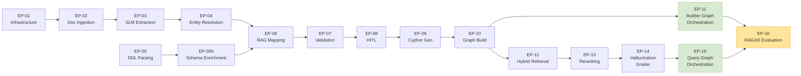
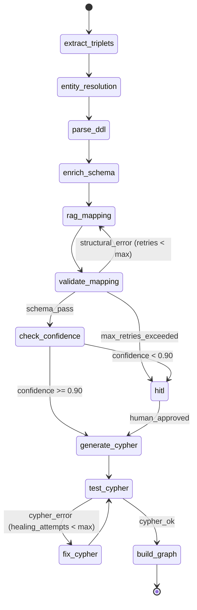
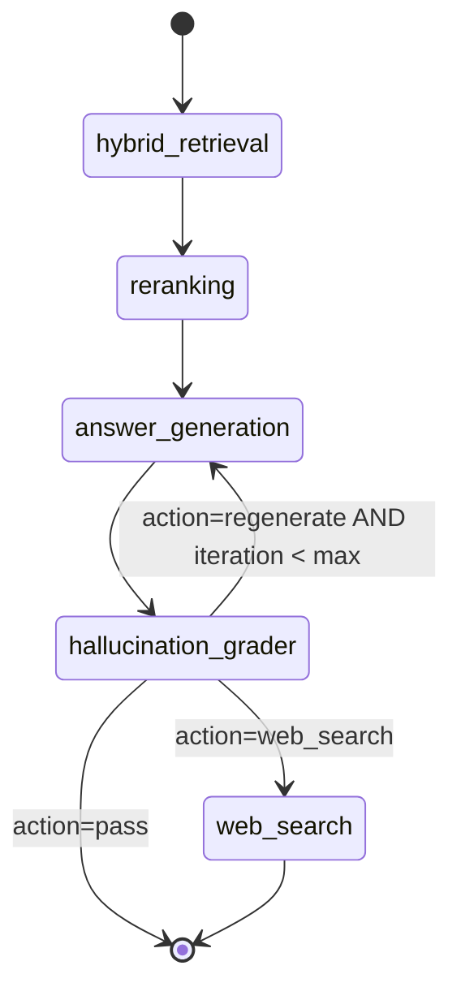
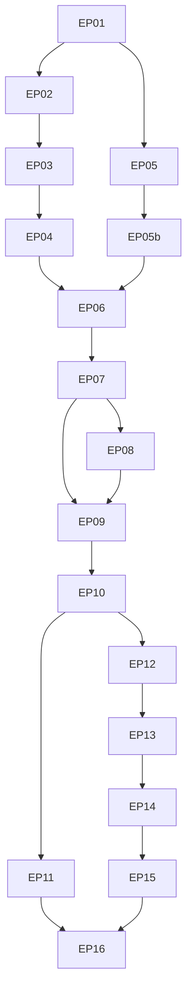

# Requirements & User Stories — Multi-Agent Framework for Semantic Discovery & GraphRAG

> **Version:** 1.0 — March 2026
> **Author:** Marc'Antonio Lopez
> **Companion document:** [SPECS.md](./SPECS.md)
> **Purpose:** Full implementation requirements. Every story includes acceptance criteria, technical constraints, and enough context to implement without ambiguity.

---

## Table of Contents

1. [Glossary](#1-glossary)
2. [Epics Overview](#2-epics-overview)
3. [Project Structure](#3-project-structure)
4. [Functional Requirements by Epic](#4-functional-requirements-by-epic)
   - [EP-01 — Infrastructure & Configuration](#ep-01--infrastructure--configuration)
   - [EP-02 — Document Ingestion & Chunking](#ep-02--document-ingestion--chunking)
   - [EP-03 — SLM Triplet Extraction](#ep-03--slm-triplet-extraction)
   - [EP-04 — Agentic Entity Resolution](#ep-04--agentic-entity-resolution)
   - [EP-05 — DDL Schema Parsing](#ep-05--ddl-schema-parsing)
   - [EP-05b — LLM Schema Enrichment](#ep-05b--llm-schema-enrichment)
   - [EP-06 — RAG Semantic Mapping](#ep-06--rag-semantic-mapping)
   - [EP-07 — Mapping Validation & Actor-Critic](#ep-07--mapping-validation--actor-critic)
   - [EP-08 — Human-in-the-Loop Breakpoint](#ep-08--human-in-the-loop-breakpoint)
   - [EP-09 — Cypher Generation & Healing](#ep-09--cypher-generation--healing)
   - [EP-10 — Knowledge Graph Build (Neo4j)](#ep-10--knowledge-graph-build-neo4j)
   - [EP-11 — Builder LangGraph Orchestration](#ep-11--builder-langgraph-orchestration)
   - [EP-12 — Hybrid Retrieval (Query Graph)](#ep-12--hybrid-retrieval-query-graph)
   - [EP-13 — Cross-Encoder Reranking](#ep-13--cross-encoder-reranking)
   - [EP-14 — Answer Generation & Hallucination Grader](#ep-14--answer-generation--hallucination-grader)
   - [EP-15 — Query LangGraph Orchestration](#ep-15--query-langgraph-orchestration)
   - [EP-16 — RAGAS Evaluation Pipeline](#ep-16--ragas-evaluation-pipeline)
5. [Non-Functional Requirements](#5-non-functional-requirements)
6. [Data Models & Schemas](#6-data-models--schemas)
7. [Prompt Templates Catalogue](#7-prompt-templates-catalogue)
8. [Configuration Reference](#8-configuration-reference)
9. [Dependency Map](#9-dependency-map)
10. [Implementation Order](#10-implementation-order)

---

## 1. Glossary

| Term | Definition |
|---|---|
| **SLM** | Small Language Model (e.g., NuExtract, Qwen2.5-3B). Used for constrained JSON extraction only. |
| **LLM** | Large frontier Language Model (e.g., Qwen2.5-Coder-32B, gpt-4o). Used for reasoning, mapping, Cypher generation. |
| **Triplet** | `(subject, predicate, object)` semantic fact extracted from text, augmented with `provenance_text`. |
| **Entity** | A canonical business concept after Entity Resolution (deduplication + canonicalization). |
| **Mapping** | A proposed alignment between a `BusinessConcept` (logical) and a `PhysicalTable` (physical). |
| **Cypher** | Neo4j's graph query language. All write operations use `MERGE` for upsert semantics. |
| **Actor-Critic** | Self-reflection pattern: the LLM (Actor) generates output; a Critic (Pydantic + LLM) validates it; errors are injected back as Reflection Prompts. |
| **Cypher Healing** | Self-correction loop where a native Neo4j exception is injected into the LLM prompt to auto-fix the query. |
| **HITL** | Human-in-the-Loop. A LangGraph interrupt breakpoint triggered when confidence < 90%. |
| **Hallucination Grader** | A node that generates a structured Critique if the answer contains claims not grounded in retrieved context. |
| **RAGAS** | Retrieval-Augmented Generation Assessment — evaluation framework for RAG pipelines. |
| **BGE-M3** | Multilingual dense embedding model by BAAI used for vector retrieval. |
| **bge-reranker-large** | Cross-Encoder reranking model by BAAI for joint query×chunk scoring. |
| **RIGOR** | Retrieval-Augmented Generation of Ontologies — the paradigm guiding the Builder Graph. |
| **Provenance** | The original text fragment from which a triplet was extracted, stored for grounding. |
| **Delta** | The incremental set of new/modified documents or tables to process on an update run. |

---

## 2. Epics Overview



| Epic ID | Name | Phase | Priority |
|---|---|---|---|
| EP-01 | Infrastructure & Configuration | Month 1 | P0 — Blocker |
| EP-02 | Document Ingestion & Chunking | Month 1 | P0 |
| EP-03 | SLM Triplet Extraction | Month 1 | P0 |
| EP-04 | Agentic Entity Resolution | Month 2 | P0 |
| EP-05 | DDL Schema Parsing | Month 1 | P0 |
| EP-05b | LLM Schema Enrichment | Month 2 | P0 |
| EP-06 | RAG Semantic Mapping | Month 2 | P0 |
| EP-07 | Mapping Validation & Actor-Critic | Month 3 | P0 |
| EP-08 | Human-in-the-Loop Breakpoint | Month 3 | P1 |
| EP-09 | Cypher Generation & Healing | Month 3 | P0 |
| EP-10 | Knowledge Graph Build (Neo4j) | Month 3 | P0 |
| EP-11 | Builder LangGraph Orchestration | Month 3 | P0 |
| EP-12 | Hybrid Retrieval (Query Graph) | Month 4 | P0 |
| EP-13 | Cross-Encoder Reranking | Month 4 | P0 |
| EP-14 | Answer Generation & Hallucination Grader | Month 4 | P0 |
| EP-15 | Query LangGraph Orchestration | Month 4 | P0 |
| EP-16 | RAGAS Evaluation Pipeline | Month 5 | P1 |

---

## 3. Project Structure

The agent must scaffold the project with this exact directory layout:

```
thesis/
├── docs/
│   └── draft/
│       ├── SPECS.md
│       ├── REQUIREMENTS.md          ← this file
│       ├── ADR.md
│       ├── PROMPTS.md
│       ├── TEST_PLAN.md
│       ├── DATASET.md
│       └── ABLATION.md
├── src/
│   ├── __init__.py
│   ├── config/
│   │   ├── __init__.py
│   │   ├── settings.py              # Pydantic BaseSettings, all env vars
│   │   ├── llm_factory.py           # ChatOpenAI builder per role (reasoning/extraction/generation)
│   │   └── logging.py               # Structured JSON logging setup
│   ├── models/
│   │   ├── __init__.py
│   │   ├── schemas.py               # All Pydantic v2 data models
│   │   └── state.py                 # LangGraph state: BuilderState, QueryState
│   ├── ingestion/
│   │   ├── __init__.py
│   │   ├── pdf_loader.py            # EP-02: PDF chunking
│   │   ├── ddl_parser.py            # EP-05: DDL SQL parser
│   │   └── schema_enricher.py       # EP-05b: LLM Schema Enrichment
│   ├── extraction/
│   │   ├── __init__.py
│   │   └── triplet_extractor.py     # EP-03: SLM extraction node
│   ├── resolution/
│   │   ├── __init__.py
│   │   ├── blocking.py              # EP-04 Stage 1: embedding-based K-NN blocking
│   │   ├── llm_judge.py             # EP-04 Stage 2: LLM merge/separate judge
│   │   └── entity_resolver.py       # EP-04: orchestrator (blocking → judge → merge)
│   ├── mapping/
│   │   ├── __init__.py
│   │   ├── rag_mapper.py            # EP-06: RAG semantic mapping node
│   │   ├── validator.py             # EP-07: Pydantic + Actor-Critic validation
│   │   └── hitl.py                  # EP-08: HITL review payload + decision handling
│   ├── graph/
│   │   ├── __init__.py
│   │   ├── cypher_generator.py      # EP-09: Cypher generation from mappings
│   │   ├── cypher_healer.py         # EP-09: Cypher healing loop (retry on error)
│   │   ├── neo4j_client.py          # EP-10: Neo4j driver wrapper
│   │   └── builder_graph.py         # EP-11: LangGraph Builder DAG
│   ├── retrieval/
│   │   ├── __init__.py
│   │   ├── embeddings.py            # EP-12: FlagEmbedding BGE-M3 wrapper
│   │   ├── hybrid_retriever.py      # EP-12: Vector + BM25 + Graph traversal
│   │   └── reranker.py              # EP-13: Cross-Encoder reranking
│   ├── generation/
│   │   ├── __init__.py
│   │   ├── answer_generator.py      # EP-14: LLM answer generation
│   │   ├── hallucination_grader.py  # EP-14: Critique + grading node
│   │   └── query_graph.py           # EP-15: LangGraph Query DAG
│   ├── prompts/
│   │   ├── __init__.py
│   │   ├── templates.py             # All prompt templates centralised
│   │   └── few_shot.py              # Few-shot example bank (Cypher, mapping)
│   └── evaluation/
│       ├── __init__.py
│       ├── ragas_runner.py          # EP-16: RAGAS evaluation pipeline
│       ├── custom_metrics.py        # EP-16: cypher_healing_rate, hitl_confidence_agreement
│       └── ablation_runner.py       # Ablation experiment runner (see ABLATION.md)
├── tests/
│   ├── conftest.py                  # Shared fixtures (settings, mock LLM, Neo4j)
│   ├── unit/
│   │   ├── __init__.py
│   │   ├── test_settings.py         # UT-01
│   │   ├── test_pdf_loader.py       # UT-02
│   │   ├── test_ddl_parser.py       # UT-03
│   │   ├── test_triplet_extractor.py # UT-04
│   │   ├── test_entity_resolver.py  # UT-05 + UT-06
│   │   ├── test_schema_enricher.py  # UT-17
│   │   ├── test_rag_mapper.py       # UT-07
│   │   ├── test_validator.py        # UT-08
│   │   ├── test_cypher_generator.py # UT-09
│   │   ├── test_cypher_healer.py    # UT-10
│   │   ├── test_neo4j_client.py     # UT-11
│   │   ├── test_hybrid_retriever.py # UT-12
│   │   ├── test_reranker.py         # UT-13
│   │   ├── test_answer_generator.py # UT-14
│   │   ├── test_hallucination_grader.py # UT-15
│   │   ├── test_prompts.py          # UT-16
│   │   └── test_web_search_fallback.py  # UT-18
│   ├── integration/
│   │   ├── __init__.py
│   │   ├── test_builder_graph.py    # IT-01, IT-02, IT-03, IT-05
│   │   ├── test_query_graph.py      # IT-06, IT-07
│   │   ├── test_cypher_healing.py   # IT-04
│   │   └── test_incremental_update.py # IT-08
│   ├── evaluation/
│   │   ├── __init__.py
│   │   ├── test_ragas.py
│   │   └── test_ablation.py
│   └── fixtures/
│       ├── sample_docs/
│       │   ├── business_glossary.txt
│       │   └── data_dictionary.txt
│       ├── sample_ddl/
│       │   ├── simple_schema.sql    # 3 tables, 1 FK
│       │   ├── complex_schema.sql   # 9 tables (8 business + 1 system)
│       │   └── system_tables.sql    # 3 system tables
│       ├── mock_responses/
│       │   ├── extraction_response.json
│       │   ├── er_judge_merge.json
│       │   ├── er_judge_separate.json
│       │   ├── mapping_high_confidence.json
│       │   ├── mapping_null.json
│       │   ├── critic_approved.json
│       │   ├── critic_rejected.json
│       │   ├── enrichment_response.json
│       │   ├── grader_faithful.json
│       │   └── grader_hallucinated.json
│       ├── few_shot_examples.json
│       └── gold_standard.json
├── notebooks/
│   └── exploration.ipynb
├── .env.example
├── .gitignore
├── pyproject.toml
└── README.md
```

---

## 4. Functional Requirements by Epic

---

### EP-01 — Infrastructure & Configuration

#### Summary
Bootstrap the project: environment, dependencies, settings management, logging, and Neo4j connection.

---

**US-01-01 — Environment & Dependency Management**

> *As a developer, I want a reproducible Python environment so that the project installs cleanly on any machine.*

**Acceptance Criteria:**
- `pyproject.toml` uses `[project]` table (PEP 621) with `requires-python = ">=3.11"`
- All direct dependencies pinned with minimum versions:

| Package | Minimum Version | Purpose |
|---|---|---|
| `langgraph` | `>=0.2` | Graph orchestration |
| `langchain` | `>=0.3` | Chain / prompt management |
| `langchain-openai` | `>=0.2` | OpenAI-compatible client |
| `langchain-community` | `>=0.3` | Community integrations |
| `neo4j` | `>=5.0` | Neo4j Python driver |
| `pydantic` | `>=2.7` | Data validation |
| `pydantic-settings` | `>=2.3` | Settings from env |
| `sentence-transformers` | `>=3.0` | BGE-M3 + reranker |
| `FlagEmbedding` | `>=1.2` | BGE-M3 advanced features |
| `pymupdf` | `>=1.24` | PDF parsing |
| `sqlglot` | `>=25.0` | DDL SQL parsing |
| `ragas` | `>=0.2` | Evaluation framework |
| `rank-bm25` | `>=0.2` | BM25 retrieval |
| `httpx` | `>=0.27` | Async HTTP client |

**Technical constraints:**
- Use `uv` or `pip` as package manager (no conda)
- Dev dependencies: `pytest`, `pytest-asyncio`, `ruff`, `mypy`

---

**US-01-02 — Settings & Secret Management**

> *As the system, I need all configuration to be loaded from environment variables so that no secrets are hardcoded.*

**Acceptance Criteria:**
- `src/config/settings.py` defines a `Settings` class using `pydantic_settings.BaseSettings`
- `.env.example` documents every variable with a comment and a safe placeholder value
- Settings are a singleton (module-level `settings = Settings()`)

**Required settings:**

```python
class Settings(BaseSettings):
    # Neo4j
    neo4j_uri: str                        # bolt://localhost:7687
    neo4j_user: str                       # neo4j
    neo4j_password: SecretStr

    # LLM (OpenAI-compatible endpoint)
    llm_base_url: str                     # supports local Ollama or OpenAI
    llm_api_key: SecretStr
    llm_model_reasoning: str              # e.g. "qwen2.5-coder:32b"
    llm_model_extraction: str             # e.g. "nuextract" or "qwen2.5:3b"
    llm_temperature_extraction: float = 0.0
    llm_temperature_reasoning: float = 0.0
    llm_temperature_generation: float = 0.3

    # Embeddings & Reranking
    embedding_model: str = "BAAI/bge-m3"
    reranker_model: str = "BAAI/bge-reranker-large"
    reranker_top_k: int = 5

    # Entity Resolution
    er_blocking_top_k: int = 10          # K-NN candidates before LLM judge
    er_similarity_threshold: float = 0.85

    # Confidence & Loops
    confidence_threshold: float = 0.90   # below this → HITL
    max_reflection_attempts: int = 3     # max Actor-Critic retries
    max_cypher_healing_attempts: int = 3
    max_hallucination_retries: int = 3

    # Chunking
    chunk_size: int = 512
    chunk_overlap: int = 64

    # Retrieval
    retrieval_vector_top_k: int = 20
    retrieval_bm25_top_k: int = 10
    retrieval_graph_depth: int = 2       # graph traversal hops

    # Few-Shot
    few_shot_cypher_examples: int = 5

    model_config = SettingsConfigDict(env_file=".env", secrets_dir="/run/secrets")
```

---

**US-01-03 — Structured Logging**

> *As a developer, I want structured JSON logs at every node boundary so that I can trace the agent's decisions.*

**Acceptance Criteria:**
- Use Python's `logging` with a JSON formatter (e.g., `python-json-logger`)
- Every LangGraph node logs: `node_name`, `input_summary`, `output_summary`, `duration_ms`, `model_used`
- Reflection/retry events log: `attempt_number`, `error_injected`, `correction_applied`
- Log level configurable via `LOG_LEVEL` env var (default: `INFO`)

---

### EP-02 — Document Ingestion & Chunking

#### Summary
Load PDF documents, extract text, and split into semantically coherent chunks that fit within the SLM's context window.

---

**US-02-01 — PDF Loading**

> *As the system, I want to load one or more PDF files and extract their raw text so that downstream nodes can process the content.*

**Acceptance Criteria:**
- `src/ingestion/pdf_loader.py` exposes `load_pdf(path: Path) -> list[Document]`
- Uses `pymupdf` (fitz) for extraction — preserves page numbers
- Each `Document` carries metadata: `{"source": filename, "page": int}`
- Handles multi-page documents; raises `IngestionError` on corrupt/password-protected files

---

**US-02-02 — Semantic Chunking**

> *As the system, I want text split into chunks of ≤512 tokens with 64-token overlap so that each SLM call has a focused, bounded context.*

**Acceptance Criteria:**
- `chunk_documents(docs: list[Document]) -> list[Chunk]` in `pdf_loader.py`
- Uses `langchain.text_splitter.RecursiveCharacterTextSplitter` with `chunk_size=settings.chunk_size`, `chunk_overlap=settings.chunk_overlap`, separators `["\n\n", "\n", ". ", " "]`
- Each `Chunk` preserves `source`, `page`, and `chunk_index` in metadata
- Token count estimated via `tiktoken` (`cl100k_base` tokenizer) — hard cap at 512 tokens per chunk

---

### EP-03 — SLM Triplet Extraction

#### Summary
Use a Small Language Model in JSON Mode to extract `(subject, predicate, object, provenance_text)` triplets from each text chunk.

---

**US-03-01 — Triplet Extraction Node**

> *As the system, I want to extract semantic triplets from each chunk using an SLM in JSON Mode so that I get structured facts with zero reasoning overhead.*

**Acceptance Criteria:**
- `src/extraction/triplet_extractor.py` exposes `extract_triplets(chunk: Chunk) -> list[Triplet]`
- Calls the SLM at `settings.llm_model_extraction` with `temperature=0.0`
- Forces JSON Mode — response must conform to the `TripletExtractionResponse` Pydantic model
- `provenance_text` field = the exact sentence(s) from the chunk that support the triplet (verbatim, not paraphrased)
- Validates response with Pydantic; on `ValidationError` → logs warning, returns empty list (does not crash the pipeline)
- Batch processing: accepts `list[Chunk]`, returns `list[Triplet]` across all chunks

**Pydantic schema enforced on SLM output:**

```python
class Triplet(BaseModel):
    subject: str                  # canonical noun phrase
    predicate: str                # relation label (verb phrase)
    object: str                   # canonical noun phrase or value
    provenance_text: str          # verbatim text fragment from source chunk
    confidence: float             # 0.0–1.0, LLM self-assessed

class TripletExtractionResponse(BaseModel):
    triplets: list[Triplet]
```

**System prompt persona:** `"You are a strict information extractor. Your only task is to extract factual (subject, predicate, object) triplets from text. Output only valid JSON. Never explain, never add commentary."`

**Temperature:** `0.0`

---

### EP-04 — Agentic Entity Resolution

#### Summary
Two-stage deduplication and canonicalization of raw entities extracted from triplets: first a fast vector-based blocking, then an LLM judge for final decisions.

---

**US-04-01 — Stage 1: Vector Blocking**

> *As the system, I want to group semantically similar entity strings using K-NN vector search so that I only call the LLM on genuinely ambiguous pairs, reducing cost.*

**Acceptance Criteria:**
- `src/resolution/entity_resolver.py` — function `block_entities(entities: list[str], embeddings: Embeddings) -> list[EntityCluster]`
- Embeds all unique entity strings with `BGE-M3`
- Computes cosine similarity; groups pairs with similarity ≥ `settings.er_similarity_threshold` into candidate clusters
- Returns `list[EntityCluster]`, where each cluster contains ≥2 entity string variants that might be the same concept
- Uses `faiss` or `sklearn.NearestNeighbors` for K-NN; `k = settings.er_blocking_top_k`

```python
class EntityCluster(BaseModel):
    canonical_candidate: str       # the most frequent / longest form
    variants: list[str]            # all near-duplicate strings
    avg_similarity: float
```

---

**US-04-02 — Stage 2: LLM Canonicalization Judge**

> *As the system, I want an LLM to make the final decision on whether entities in a cluster refer to the same real-world concept so that I correctly resolve ambiguous cases (e.g., "Apple" company vs "Apple" fruit).*

**Acceptance Criteria:**
- `resolve_clusters(clusters: list[EntityCluster], original_triplets: list[Triplet]) -> list[Entity]`
- For each cluster, the LLM receives:
  1. The candidate entity strings
  2. Their `provenance_text` from the original triplets (critical for disambiguation)
- LLM returns a `CanonicalEntityDecision` JSON object
- If `merge = true`: all variants collapse to `canonical_name`; triplets updated accordingly
- If `merge = false`: variants kept as distinct entities
- Max LLM calls = number of clusters (not number of entity pairs)

```python
class CanonicalEntityDecision(BaseModel):
    merge: bool
    canonical_name: str
    reasoning: str             # brief explanation (for logging only)
```

**System prompt persona:** `"You are a semantic disambiguation expert. Given a set of entity name variants and their original context sentences, decide if they all refer to the same real-world concept. Output only valid JSON."`

---

### EP-05 — DDL Schema Parsing

#### Summary
Parse raw SQL DDL statements into structured Python objects — no LLM involved. This is deterministic.

---

**US-05-01 — DDL Parser**

> *As the system, I want to parse SQL DDL files into structured `TableSchema` objects so that downstream mapping nodes receive clean, typed metadata.*

**Acceptance Criteria:**
- `src/ingestion/ddl_parser.py` exposes `parse_ddl(ddl_text: str) -> list[TableSchema]`
- Uses `sqlglot` library with dialect auto-detection (support: `mysql`, `postgres`, `tsql`, `oracle`)
- Extracts: table name, schema name, column names, column data types, primary keys, foreign keys, comments/descriptions if present
- Returns `list[TableSchema]`; raises `DDLParseError` on unparseable input
- No LLM call at this stage

```python
class ColumnSchema(BaseModel):
    name: str
    data_type: str
    is_primary_key: bool = False
    is_foreign_key: bool = False
    references: str | None = None   # "other_table.col"
    comment: str | None = None

class TableSchema(BaseModel):
    table_name: str
    schema_name: str | None = None
    columns: list[ColumnSchema]
    ddl_source: str                  # raw DDL string for this table
    comment: str | None = None
```

---

### EP-05b — LLM Schema Enrichment

#### Summary
Expand abbreviated DDL identifiers (table/column names) into human-readable English names and generate a short natural-language table description. This resolves the **Lexical Gap** between cryptic schema naming conventions (`TB_CST`, `ORD_DT`) and business glossary terminology, improving downstream embedding similarity and LLM mapping quality. See ADR-15.

---

**US-05b-01 — Schema Enrichment Node**

> *As the system, I want abbreviated table and column names expanded into human-readable English so that embedding similarity with business glossary terms is maximised before the mapping step.*

**Acceptance Criteria:**
- `src/ingestion/schema_enricher.py` exposes `enrich_schema(table: TableSchema, llm: BaseChatModel) -> EnrichedTableSchema`
- LLM called at `settings.llm_model_reasoning` with `temperature=0.0`
- Prompt: `ENRICHMENT_SYSTEM` + `ENRICHMENT_USER` from `src/prompts/templates.py`
- Output validated with Pydantic `EnrichedTableSchema` model
- On `ValidationError` → logs warning, returns original `TableSchema` fields with `enriched_table_name=None` (does not crash)
- Original `table_name` and `column.name` values are **never overwritten** — enriched names are stored in separate fields

**Pydantic schemas (add to `src/models/schemas.py`):**

```python
class EnrichedColumn(BaseModel):
    original_name: str          # "CUST_ID" — unchanged
    enriched_name: str          # "Customer ID" — human-readable

class EnrichedTableSchema(BaseModel):
    # Inherited from TableSchema
    table_name: str
    schema_name: str | None = None
    columns: list[ColumnSchema]
    ddl_source: str
    comment: str | None = None
    # Enrichment fields
    enriched_table_name: str | None = None
    enriched_columns: list[EnrichedColumn] = Field(default_factory=list)
    table_description: str | None = None
```

**System prompt persona:** `"You are a database naming expert. Expand abbreviated table and column identifiers into precise, human-readable English names. Output only valid JSON."`

---

**US-05b-02 — Batch Enrichment**

> *As the system, I want all parsed tables enriched in batch so that the pipeline does not require manual intervention per table.*

**Acceptance Criteria:**
- `enrich_all_schemas(tables: list[TableSchema], llm: BaseChatModel) -> list[EnrichedTableSchema]`
- Processes each table independently (one LLM call per table)
- If a single table enrichment fails, the unenriched `TableSchema` is promoted to `EnrichedTableSchema` with `enriched_table_name=None` and the pipeline continues
- Enriched tables are stored in `BuilderState.enriched_tables`

---

**US-05b-03 — Enriched Metadata for Embedding**

> *As the system, I want the enriched table names and descriptions used for embedding construction so that vector similarity between table metadata and business concepts is improved.*

**Acceptance Criteria:**
- The retrieval query in `retrieve_context_for_table()` (EP-06 US-06-01) is built from `enriched_table_name + enriched_column_names + table_description` when available, falling back to original identifiers if enrichment is absent
- Original identifiers (`table_name`, `column.name`) remain authoritative for Cypher generation (EP-09)

---

### EP-06 — RAG Semantic Mapping

#### Summary
For each physical table, use Map-Reduce RAG to find the most relevant business concepts from the resolved entity list and generate a mapping proposal.

---

**US-06-01 — Contextual Retrieval per Table**

> *As the system, I want to retrieve only the business context relevant to a single table so that the LLM's attention is not diluted by unrelated information.*

**Acceptance Criteria:**
- `src/mapping/rag_mapper.py` — `retrieve_context_for_table(table: TableSchema, entities: list[Entity], vector_store) -> list[Entity]`
- Builds a retrieval query from: table name + column names + comments
- Queries the vector store (pre-indexed entities with provenance) and returns Top-K most relevant entities (K = `settings.retrieval_vector_top_k`)
- This is the **Map-Reduce** pattern: one retrieval call per table, not one call for all tables at once

---

**US-06-02 — Mapping Proposal Generation**

> *As the system, I want the LLM to propose a semantic mapping between a business concept and a physical table, with a confidence score, so that the validation node can assess it.*

**Acceptance Criteria:**
- `propose_mapping(table: TableSchema, relevant_entities: list[Entity], few_shot_examples: list[MappingExample]) -> MappingProposal`
- LLM called at `settings.llm_model_reasoning`, `temperature=0.0`
- Prompt includes: table DDL, entity definitions + provenance, 3–5 few-shot validated mapping examples
- Output is a `MappingProposal` Pydantic object
- If no plausible mapping exists, LLM must return `mapped_concept = null` (not hallucinate)

```python
class MappingProposal(BaseModel):
    table_name: str
    mapped_concept: str | None       # null if no mapping found
    confidence: float                # 0.0–1.0
    reasoning: str                   # why this mapping was chosen
    alternative_concepts: list[str]  # runner-ups if ambiguous
```

---

### EP-07 — Mapping Validation & Actor-Critic

#### Summary
Validate mapping proposals with Pydantic schema enforcement + an LLM critic. Failed validations produce a Reflection Prompt injected back into the mapping node.

---

**US-07-01 — Pydantic Schema Validation**

> *As the system, I want every mapping proposal validated against a strict Pydantic schema before it proceeds so that structurally malformed outputs are caught immediately.*

**Acceptance Criteria:**
- `src/mapping/validator.py` — `validate_schema(proposal: dict) -> tuple[MappingProposal | None, str | None]`
- Returns `(validated_object, None)` on success
- Returns `(None, error_message)` on `ValidationError`, where `error_message` is the full Pydantic error string
- The error string is later injected into the Reflection Prompt as-is

---

**US-07-02 — LLM Actor-Critic Semantic Review**

> *As the system, I want an LLM critic to review structurally valid mappings for semantic correctness so that logically wrong but syntactically valid mappings are caught.*

**Acceptance Criteria:**
- `critic_review(proposal: MappingProposal, table: TableSchema, entities: list[Entity]) -> CriticDecision`
- LLM critic receives the proposal + original table DDL + entity definitions
- Returns `CriticDecision`

```python
class CriticDecision(BaseModel):
    approved: bool
    critique: str | None        # populated if approved=False
    suggested_correction: str | None
```

- If `approved=False`: `critique` text is injected into the Reflection Prompt for the mapping node to retry
- **Max retries:** `settings.max_reflection_attempts` (default: 3). After exhaustion → escalate to HITL

---

**US-07-03 — Reflection Prompt Construction**

> *As the system, I want the Reflection Prompt to embed the exact error or critique so that the LLM has precise, actionable feedback for self-correction.*

**Reflection Prompt template (`src/prompts/templates.py`):**

```
System: You are a {role}. Return only valid {format}. No explanations.

Your previous attempt failed with the following error:
<error>
{error_or_critique}
</error>

Original input that must be processed:
<input>
{original_input_json}
</input>

Regenerate a corrected {format} that fully resolves the error above.
Do not repeat the mistake. Do not add any text outside the JSON.
```

---

### EP-08 — Human-in-the-Loop Breakpoint

#### Summary
When confidence < 90% after validation (or after max reflection retries), the LangGraph pipeline pauses and waits for human review.

---

**US-08-01 — HITL Interrupt Mechanism**

> *As a data governance analyst, I want the system to pause and show me low-confidence mappings for review so that I can correct semantic ambiguities the AI cannot resolve alone.*

**Acceptance Criteria:**
- Implemented as a LangGraph `interrupt()` call (not a polling loop)
- The interrupt payload exposes to the human: `table_name`, `proposed_concept`, `confidence`, `reasoning`, `alternative_concepts`, `provenance_text`
- Human can either:
  1. **Approve** the proposal as-is (`action: "approve"`)
  2. **Correct** it by providing a different `mapped_concept` (`action: "correct", mapped_concept: "..."`)
  3. **Reject** (no mapping for this table) (`action: "reject"`)
- After human input, the graph resumes from the `Generate_Cypher` node with the human-approved mapping
- HITL decisions are persisted in state so that on graph re-run they are not re-asked

**LangGraph checkpointing requirement:** Use `MemorySaver` (dev) or `SqliteSaver` (production) so that graph state survives process restarts.

---

### EP-09 — Cypher Generation & Healing

#### Summary
Generate Neo4j Cypher `MERGE` statements from validated mappings, test them against Neo4j, and auto-fix syntax errors via Reflection Prompts.

---

**US-09-01 — Cypher Generation**

> *As the system, I want to generate valid MERGE-based Cypher statements from a validated mapping so that I can upsert the ontology into Neo4j without duplicates.*

**Acceptance Criteria:**
- `src/graph/cypher_generator.py` — `generate_cypher(mapping: MappingProposal, table: TableSchema, entity: Entity, few_shot: list[CypherExample]) -> str`
- LLM called at `settings.llm_model_reasoning`, `temperature=0.0`
- Prompt injects `settings.few_shot_cypher_examples` validated `(SQL DDL snippet → Cypher)` examples
- Generated Cypher MUST use only `MERGE` for writes — never `CREATE` alone (to enable idempotent upsert)
- Output: raw Cypher string (no markdown fence, no explanation)

**System prompt persona:** `"You are a Neo4j Cypher expert. Generate ONLY valid Cypher using MERGE for all write operations. Never use bare CREATE. Return only the Cypher code, no explanation, no markdown."`

**Required output structure for every mapping:**

```cypher
MERGE (bc:BusinessConcept {name: $concept_name})
ON CREATE SET bc.definition = $definition,
             bc.provenance_text = $provenance,
             bc.source_doc = $source_doc,
             bc.synonyms = $synonyms,
             bc.confidence_score = $confidence

MERGE (pt:PhysicalTable {table_name: $table_name})
ON CREATE SET pt.schema_name = $schema_name,
             pt.column_names = $column_names,
             pt.column_types = $column_types,
             pt.ddl_source = $ddl_source

MERGE (bc)-[:MAPPED_TO {
    confidence: $mapping_confidence,
    validated_by: $validator,
    created_at: datetime()
}]->(pt)
```

---

**US-09-02 — Cypher Execution Test**

> *As the system, I want to dry-run each Cypher statement against Neo4j before committing so that I catch syntax errors before they corrupt the graph.*

**Acceptance Criteria:**
- `test_cypher(cypher: str, driver: neo4j.Driver) -> tuple[bool, str | None]`
- Uses `EXPLAIN` prefix (Neo4j explains the query plan without executing it) for syntax validation
- Returns `(True, None)` on success
- Returns `(False, error_message)` on any `neo4j.exceptions.CypherSyntaxError` or `neo4j.exceptions.ClientError`
- The raw exception message is the `error_message` injected into the Healing Prompt

---

**US-09-03 — Cypher Healing Loop**

> *As the system, I want to automatically fix Cypher syntax errors by injecting the Neo4j exception back into the LLM prompt so that transient generation mistakes are corrected without human intervention.*

**Acceptance Criteria:**
- Healing loop: `generate_cypher` → `test_cypher` → if fail → `fix_cypher` → `test_cypher` → ...
- Max iterations: `settings.max_cypher_healing_attempts` (default: 3)
- After max attempts with no success: log `CRITICAL`, mark this mapping as `cypher_failed=True`, skip it, continue with next mapping (do not crash the pipeline)
- `fix_cypher(cypher: str, error: str, original_mapping: MappingProposal) -> str` uses the same Reflection Prompt template as EP-07

---

### EP-10 — Knowledge Graph Build (Neo4j)

#### Summary
Neo4j client wrapper with connection management, index setup, and batch Cypher execution.

---

**US-10-01 — Neo4j Client & Connection**

> *As the system, I want a managed Neo4j connection that handles auth, retries, and proper session lifecycle so that no connection leaks occur.*

**Acceptance Criteria:**
- `src/graph/neo4j_client.py` — class `Neo4jClient` with `__enter__`/`__exit__` context manager
- Connection parameters from `settings.neo4j_uri`, `settings.neo4j_user`, `settings.neo4j_password`
- Exposes: `execute_cypher(cypher: str, params: dict) -> list[dict]`
- Exposes: `execute_batch(statements: list[tuple[str, dict]]) -> None` — runs in a single transaction
- Auto-retry on transient `ServiceUnavailable` (max 3 retries, exponential backoff)

---

**US-10-02 — Index & Constraint Setup**

> *As the system, I want Neo4j indexes and vector indexes created on startup so that queries are fast and entity lookups are unique.*

**Acceptance Criteria:**
- `setup_schema(client: Neo4jClient) -> None` runs once at startup (idempotent `CREATE INDEX IF NOT EXISTS`)
- Required constraints and indexes:

```cypher
CREATE CONSTRAINT IF NOT EXISTS FOR (n:BusinessConcept) REQUIRE n.name IS UNIQUE;
CREATE CONSTRAINT IF NOT EXISTS FOR (n:PhysicalTable) REQUIRE n.table_name IS UNIQUE;
CREATE INDEX IF NOT EXISTS FOR (n:BusinessConcept) ON (n.name);
CREATE INDEX IF NOT EXISTS FOR (n:PhysicalTable) ON (n.table_name);
-- Vector index for BGE-M3 embeddings (dimension=1024)
CREATE VECTOR INDEX businessconcept_embedding IF NOT EXISTS
FOR (n:BusinessConcept) ON n.embedding
OPTIONS {indexConfig: {`vector.dimensions`: 1024, `vector.similarity_function`: 'cosine'}};
```

---

**US-10-03 — Embedding Storage on Graph Nodes**

> *As the system, I want BGE-M3 embeddings stored on every `BusinessConcept` node in the graph so that vector similarity queries can run directly on Neo4j.*

**Acceptance Criteria:**
- When upserting a `BusinessConcept`, compute its embedding: `embed(f"{name}: {definition}")`
- Store as `n.embedding` property (list of 1024 floats)
- Update embedding on `ON MATCH SET` only if `definition` changed

---

### EP-11 — Builder LangGraph Orchestration

#### Summary
Wire all Builder nodes into a single LangGraph `StateGraph` with proper conditional edges, retry counters, and HITL interrupt.

---

**US-11-01 — Builder StateGraph Definition**

> *As the system, I want a LangGraph StateGraph that encodes the full Builder workflow so that node transitions, loops, and checkpoints are explicitly defined and reproducible.*

**Node sequence and routing:**



**Acceptance Criteria:**
- `src/graph/builder_graph.py` — function `build_builder_graph() -> CompiledGraph`
- `BuilderState` TypedDict defined in `src/models/schemas.py`
- Checkpointer: `MemorySaver` injected at compile time (swappable to `SqliteSaver`)
- All `MAX_RETRIES` guards use state counters (`reflection_attempts`, `healing_attempts`) — never infinite loops
- Graph is compiled with `interrupt_before=["hitl"]` to enable HITL pausing
- Entry point: `graph.invoke({"raw_documents": [...], "ddl_statements": [...]})`

---

### EP-12 — Hybrid Retrieval (Query Graph)

#### Summary
Retrieve relevant context from Neo4j using three parallel retrieval methods: dense vector search, BM25 keyword search, and graph traversal.

---

**US-12-01 — Dense Vector Retrieval**

> *As the system, I want to retrieve BusinessConcept nodes semantically similar to the user query so that I capture paraphrases and synonyms correctly.*

**Acceptance Criteria:**
- `src/retrieval/hybrid_retriever.py` — `vector_search(query: str, client: Neo4jClient, top_k: int) -> list[RetrievedChunk]`
- Embeds query with `BGE-M3`
- Runs Neo4j vector index query against `businessconcept_embedding`
- Returns Top-K `RetrievedChunk` with `score`, `source_type="vector"`, and node properties

---

**US-12-02 — BM25 Keyword Retrieval**

> *As the system, I want to retrieve nodes matching exact keywords in the query (e.g., table names, IDs) so that rare tokens not captured by dense embeddings are found.*

**Acceptance Criteria:**
- `bm25_search(query: str, all_nodes: list[dict], top_k: int) -> list[RetrievedChunk]`
- Uses `rank-bm25` (`BM25Okapi`) on a pre-built index of node `name + definition + table_name + column_names` text
- Index rebuilt at query graph startup from Neo4j node dump
- Returns Top-K `RetrievedChunk` with `score`, `source_type="bm25"`

---

**US-12-03 — Graph Traversal Context Expansion**

> *As the system, I want to expand retrieved nodes to their graph neighbours so that relational context (e.g., tables that JOIN a matched table) is included in the answer context.*

**Acceptance Criteria:**
- `graph_traversal(seed_nodes: list[str], client: Neo4jClient, depth: int) -> list[RetrievedChunk]`
- Starting from seed node names, traverses up to `settings.retrieval_graph_depth` hops
- Traversal query:

```cypher
MATCH (start)-[r*1..{depth}]-(neighbor)
WHERE start.name IN $seed_names
RETURN neighbor, r, type(r) as rel_type
```

- Returns `RetrievedChunk` with `source_type="graph"`, includes relationship type in metadata

---

**US-12-04 — Result Merging**

> *As the system, I want results from all three retrieval methods merged and deduplicated so that the reranker receives a clean, non-redundant candidate set.*

**Acceptance Criteria:**
- `merge_results(vector: list, bm25: list, graph: list) -> list[RetrievedChunk]`
- Deduplication by node `name` — keep highest score across methods
- Maximum merged pool size: `settings.retrieval_vector_top_k + settings.retrieval_bm25_top_k` (before reranking)

```python
class RetrievedChunk(BaseModel):
    node_id: str
    node_type: str                   # "BusinessConcept" | "PhysicalTable"
    text: str                        # formatted as "name: definition"
    score: float
    source_type: str                 # "vector" | "bm25" | "graph"
    metadata: dict                   # all node properties
```

---

### EP-13 — Cross-Encoder Reranking

#### Summary
Use `bge-reranker-large` to jointly score each `(query, chunk)` pair and select the Top-K highest-density chunks for generation.

---

**US-13-01 — Cross-Encoder Reranking Node**

> *As the system, I want to rerank all retrieved candidates using a Cross-Encoder so that only information-dense, query-relevant chunks reach the LLM generator.*

**Acceptance Criteria:**
- `src/retrieval/reranker.py` — `rerank(query: str, chunks: list[RetrievedChunk]) -> list[RetrievedChunk]`
- Uses `FlagReranker("BAAI/bge-reranker-large", use_fp16=True)`
- Calls `reranker.compute_score([(query, chunk.text) for chunk in chunks])`
- Returns chunks sorted descending by reranker score, sliced to `settings.reranker_top_k`
- Adds `reranker_score` to each chunk's metadata
- Must run on CPU if no GPU available (graceful fallback)

---

### EP-14 — Answer Generation & Hallucination Grader

#### Summary
Generate a grounded natural language answer using the Top-K chunks, then validate it with a Hallucination Grader that produces structured Critiques.

---

**US-14-01 — Answer Generation Node**

> *As the system, I want to generate a precise answer to the user's query using only the reranked context chunks so that the answer is factually grounded.*

**Acceptance Criteria:**
- `src/generation/answer_generator.py` — `generate_answer(query: str, chunks: list[RetrievedChunk], critique: str | None) -> str`
- LLM at `settings.llm_model_reasoning`, `temperature=settings.llm_temperature_generation` (0.3)
- Prompt includes:
  1. Retrieved context (formatted as numbered list of `"[N] {text}"`)
  2. If `critique` is not None: adds `"<previous_critique>{critique}</previous_critique>"` before the question
- Hard constraint in system prompt: "Answer only from the provided context. If the answer is not in the context, say 'I cannot find this information in the knowledge graph.'"

---

**US-14-02 — Hallucination Grader Node**

> *As the system, I want a grader node to detect unsupported claims in the generated answer and produce a natural-language Critique so that the generator has precise, actionable feedback for correction.*

**Acceptance Criteria:**
- `src/generation/hallucination_grader.py` — `grade_answer(query: str, answer: str, chunks: list[RetrievedChunk]) -> GraderDecision`
- LLM at `settings.llm_model_reasoning`, `temperature=0.0`
- Grader receives: the user query, the generated answer, and all context chunks
- Returns `GraderDecision`:

```python
class GraderDecision(BaseModel):
    grounded: bool
    critique: str | None       # human-readable, names specific unsupported entities
    action: Literal["pass", "regenerate", "web_search"]
    # action rules:
    # "pass"        → grounded=True
    # "regenerate"  → grounded=False, some context exists
    # "web_search"  → context is entirely irrelevant to the query
```

- Critique must name specific entities/claims that are unsupported: e.g., `"The table TB_ORDERS is not mentioned in any retrieved context. Reformulate omitting TB_ORDERS."`
- **Loop guard:** `QueryState.iteration_count` incremented on each regenerate; after `settings.max_hallucination_retries` → force `action="web_search"` regardless of grader output

---

**US-14-03 — Web Search Fallback**

> *As the system, I want a fallback to external web search when the knowledge graph contains no relevant context so that the user still receives a useful answer.*

**Acceptance Criteria:**
- `web_search_fallback(query: str) -> str` in `answer_generator.py`
- Uses LangChain's `TavilySearch` or `DuckDuckGoSearch` tool
- Returns raw search result summary as a string
- Final answer is labelled with `"[Source: Web Search]"` prefix to distinguish from graph-grounded answers

---

### EP-15 — Query LangGraph Orchestration

#### Summary
Wire all Query Graph nodes into a `StateGraph` with the hallucination retry loop and web search fallback.

---

**US-15-01 — Query StateGraph Definition**

> *As the system, I want a LangGraph StateGraph for the Query Graph so that the hallucination feedback loop is formally defined with a loop guard.*

**Node sequence and routing:**



**Acceptance Criteria:**
- `src/generation/query_graph.py` — `build_query_graph() -> CompiledGraph`
- `QueryState` TypedDict in `src/models/schemas.py`
- Conditional routing on `GraderDecision.action`
- `iteration_count` checked before routing to `answer_generation`; if `>= max_hallucination_retries` → route to `web_search`
- Entry point: `graph.invoke({"user_query": "..."})`
- Returns: `{"final_answer": "...", "sources": [...]}`

---

### EP-16 — RAGAS Evaluation Pipeline

#### Summary
Automated evaluation of both the retrieval quality and generation quality using RAGAS metrics, run against a synthetic gold-standard dataset.

---

**US-16-01 — Gold Standard Dataset**

> *As a researcher, I want a structured gold-standard dataset so that RAGAS can compare system outputs against ground truth.*

**Acceptance Criteria:**
- `tests/fixtures/gold_standard.json` — array of evaluation samples:

```json
[
  {
    "question": "Which table stores customer purchase history?",
    "ground_truth": "The PURCHASE_HISTORY table maps to the 'Customer Transaction' business concept.",
    "ground_truth_context": ["PURCHASE_HISTORY stores transactional data per customer..."],
    "reference_concept": "Customer Transaction",
    "reference_table": "PURCHASE_HISTORY"
  }
]
```

- Minimum 50 samples for meaningful evaluation
- Covers: direct mapping queries, multi-hop relational queries, negative queries (concepts not in schema)

---

**US-16-02 — RAGAS Metrics Computation**

> *As a researcher, I want RAGAS metrics computed automatically after each development milestone so that I have quantitative proof of system quality.*

**Acceptance Criteria:**
- `src/evaluation/ragas_runner.py` — `run_evaluation(dataset: list[dict], query_graph: CompiledGraph) -> EvaluationReport`
- Runs each question through the Query Graph, collects `(question, answer, retrieved_contexts)`
- Computes via RAGAS:
  - `faithfulness` — answer vs context grounding
  - `context_precision` — signal-to-noise in retrieved chunks
  - `context_recall` — coverage of gold context
  - `answer_relevancy` — does answer address the question
- Also computes system-specific metrics:
  - `cypher_healing_rate` — from Builder logs
  - `hitl_confidence_agreement` — auto-approved mappings vs gold standard

**Output report:**

```python
class EvaluationReport(BaseModel):
    timestamp: datetime
    num_samples: int
    faithfulness: float
    context_precision: float
    context_recall: float
    answer_relevancy: float
    cypher_healing_rate: float
    hitl_confidence_agreement: float
    failed_samples: list[dict]   # samples below threshold
```

- Report saved to `evaluation_reports/{timestamp}.json`
- CLI command: `python -m src.evaluation.ragas_runner --dataset tests/fixtures/gold_standard.json`

**Target thresholds (from SPECS.md):**

| Metric | Target |
|---|---|
| `context_precision` | ≥ 0.85 |
| `context_recall` | ≥ 0.90 |
| `faithfulness` | ≥ 0.95 |
| `cypher_healing_rate` | ≥ 0.80 |
| `hitl_confidence_agreement` | ≥ 0.90 |

---

## 5. Non-Functional Requirements

| ID | Category | Requirement | Acceptance |
|---|---|---|---|
| NFR-01 | **Idempotency** | Re-running the Builder on the same input must produce identical graph state (no duplicate nodes) | All writes use `MERGE`; test with double-run assertion |
| NFR-02 | **Resilience** | A single failed Cypher or extraction does not crash the pipeline | Errors caught per-item; logged and skipped |
| NFR-03 | **Observability** | Every LLM call logs: model, prompt tokens, completion tokens, latency | Via LangChain callbacks |
| NFR-04 | **Testability** | Every node function is independently unit-testable with mocked LLM/DB | Pure functions where possible; dependency injection |
| NFR-05 | **Cost efficiency** | SLM used for extraction (not LLM) to minimise inference cost | Measured: SLM calls vs LLM calls ratio logged per run |
| NFR-06 | **Configurability** | All thresholds and model names configurable via `.env` without code changes | Validated by `settings.py` |
| NFR-07 | **Reproducibility** | `temperature=0.0` on all extraction/mapping nodes ensures deterministic outputs | Enforced in all node implementations |
| NFR-08 | **Incremental updates** | Processing a new DDL file only writes the delta to Neo4j, not a full rebuild | Ensured by `MERGE` strategy + delta detection |
| NFR-09 | **Type safety** | All public functions use full Python type annotations; `mypy --strict` passes | `mypy` in CI |
| NFR-10 | **Code style** | `ruff` linting + formatting; no `print()` statements (use `logging`) | `ruff check .` passes with zero errors |

---

## 6. Data Models & Schemas

Complete Pydantic v2 schemas — define these in `src/models/schemas.py`:

```python
from pydantic import BaseModel, Field
from typing import Literal
from datetime import datetime

# ── Ingestion ──────────────────────────────────────────────────────────────────

class Document(BaseModel):
    text: str
    metadata: dict = Field(default_factory=dict)  # source, page

class Chunk(BaseModel):
    text: str
    chunk_index: int
    metadata: dict = Field(default_factory=dict)  # source, page, token_count

# ── Extraction ─────────────────────────────────────────────────────────────────

class Triplet(BaseModel):
    subject: str
    predicate: str
    object: str
    provenance_text: str
    confidence: float = Field(ge=0.0, le=1.0)
    source_chunk_index: int | None = None

class TripletExtractionResponse(BaseModel):
    triplets: list[Triplet]

# ── Entity Resolution ──────────────────────────────────────────────────────────

class EntityCluster(BaseModel):
    canonical_candidate: str
    variants: list[str]
    avg_similarity: float

class CanonicalEntityDecision(BaseModel):
    merge: bool
    canonical_name: str
    reasoning: str

class Entity(BaseModel):
    name: str
    definition: str
    synonyms: list[str] = Field(default_factory=list)
    provenance_text: str
    source_doc: str
    embedding: list[float] | None = None

# ── Schema Parsing ─────────────────────────────────────────────────────────────

class ColumnSchema(BaseModel):
    name: str
    data_type: str
    is_primary_key: bool = False
    is_foreign_key: bool = False
    references: str | None = None
    comment: str | None = None

class TableSchema(BaseModel):
    table_name: str
    schema_name: str | None = None
    columns: list[ColumnSchema]
    ddl_source: str
    comment: str | None = None

class EnrichedColumn(BaseModel):
    original_name: str          # "CUST_ID" — unchanged
    enriched_name: str          # "Customer ID" — human-readable

class EnrichedTableSchema(BaseModel):
    # Inherited from TableSchema
    table_name: str
    schema_name: str | None = None
    columns: list[ColumnSchema]
    ddl_source: str
    comment: str | None = None
    # Enrichment fields
    enriched_table_name: str | None = None
    enriched_columns: list[EnrichedColumn] = Field(default_factory=list)
    table_description: str | None = None

# ── Mapping ────────────────────────────────────────────────────────────────────

class MappingProposal(BaseModel):
    table_name: str
    mapped_concept: str | None
    confidence: float = Field(ge=0.0, le=1.0)
    reasoning: str
    alternative_concepts: list[str] = Field(default_factory=list)

class CriticDecision(BaseModel):
    approved: bool
    critique: str | None = None
    suggested_correction: str | None = None

class MappingExample(BaseModel):          # few-shot examples
    ddl_snippet: str
    concept_name: str
    concept_definition: str
    cypher: str

# ── Cypher ─────────────────────────────────────────────────────────────────────

class CypherExample(BaseModel):           # few-shot examples for Cypher gen
    description: str
    cypher: str

class CypherStatement(BaseModel):
    cypher: str
    params: dict = Field(default_factory=dict)
    mapping_id: str                        # table_name + concept_name

# ── Retrieval ──────────────────────────────────────────────────────────────────

class RetrievedChunk(BaseModel):
    node_id: str
    node_type: str
    text: str
    score: float
    source_type: Literal["vector", "bm25", "graph"]
    metadata: dict = Field(default_factory=dict)
    reranker_score: float | None = None

# ── Generation ────────────────────────────────────────────────────────────────

class GraderDecision(BaseModel):
    grounded: bool
    critique: str | None = None
    action: Literal["pass", "regenerate", "web_search"]

# ── LangGraph States ──────────────────────────────────────────────────────────

class BuilderState(BaseModel):
    # Inputs
    raw_documents: list[Document] = Field(default_factory=list)
    ddl_statements: list[str] = Field(default_factory=list)
    # Extraction
    triplets: list[Triplet] = Field(default_factory=list)
    resolved_entities: list[Entity] = Field(default_factory=list)
    # Schema
    table_schemas: list[TableSchema] = Field(default_factory=list)
    enriched_tables: list[EnrichedTableSchema] = Field(default_factory=list)
    # Mapping
    mapping_proposals: list[MappingProposal] = Field(default_factory=list)
    validation_errors: list[str] = Field(default_factory=list)
    reflection_attempts: int = 0
    # HITL
    hitl_required: bool = False
    hitl_decision: dict | None = None
    # Cypher
    cypher_statements: list[CypherStatement] = Field(default_factory=list)
    cypher_errors: list[str] = Field(default_factory=list)
    healing_attempts: int = 0
    # Output
    failed_mappings: list[str] = Field(default_factory=list)

class QueryState(BaseModel):
    user_query: str
    retrieved_chunks: list[RetrievedChunk] = Field(default_factory=list)
    reranked_chunks: list[RetrievedChunk] = Field(default_factory=list)
    generated_answer: str = ""
    hallucination_critique: str | None = None
    iteration_count: int = 0
    final_answer: str = ""
    sources: list[str] = Field(default_factory=list)

# ── Evaluation ────────────────────────────────────────────────────────────────

class EvaluationReport(BaseModel):
    timestamp: datetime
    num_samples: int
    faithfulness: float
    context_precision: float
    context_recall: float
    answer_relevancy: float
    cypher_healing_rate: float
    hitl_confidence_agreement: float
    failed_samples: list[dict] = Field(default_factory=list)
```

---

## 7. Prompt Templates Catalogue

All prompts live in `src/prompts/templates.py` as Python string constants. The agent must not inline prompts in node functions.

| Constant Name | Node | Key Variables |
|---|---|---|
| `EXTRACTION_SYSTEM` | `Extract_Triplets_SLM` | — |
| `EXTRACTION_USER` | `Extract_Triplets_SLM` | `{chunk_text}` |
| `ER_JUDGE_SYSTEM` | `Agentic_Entity_Resolution` | — |
| `ER_JUDGE_USER` | `Agentic_Entity_Resolution` | `{variants_json}`, `{provenance_json}` |
| `MAPPING_SYSTEM` | `Retrieval_Augmented_Mapping_LLM` | — |
| `MAPPING_USER` | `Retrieval_Augmented_Mapping_LLM` | `{table_ddl}`, `{entities_json}`, `{few_shot_examples}` |
| `CRITIC_SYSTEM` | `Validate_Mapping_Logic` | — |
| `CRITIC_USER` | `Validate_Mapping_Logic` | `{proposal_json}`, `{table_ddl}`, `{entities_json}` |
| `REFLECTION_TEMPLATE` | All reflection loops | `{role}`, `{format}`, `{error_or_critique}`, `{original_input_json}` |
| `CYPHER_SYSTEM` | `Generate_Cypher` | — |
| `CYPHER_USER` | `Generate_Cypher` | `{table_ddl}`, `{concept_json}`, `{few_shot_examples}` |
| `CYPHER_FIX_USER` | `Fix_Cypher_LLM` | `{broken_cypher}`, `{error_message}` |
| `ANSWER_SYSTEM` | `Answer_Generation_LLM` | — |
| `ANSWER_USER` | `Answer_Generation_LLM` | `{context_chunks}`, `{query}`, `{critique?}` |
| `GRADER_SYSTEM` | `Hallucination_Grader` | — |
| `GRADER_USER` | `Hallucination_Grader` | `{context_chunks}`, `{answer}`, `{query}` |
| `ENRICHMENT_SYSTEM` | `LLM_Schema_Enrichment` | — |
| `ENRICHMENT_USER` | `LLM_Schema_Enrichment` | `{table_name}`, `{columns_text}` |

---

## 8. Configuration Reference

Complete `.env.example`:

```bash
# ── Neo4j ──────────────────────────────────────────────────────────────────────
NEO4J_URI=bolt://localhost:7687
NEO4J_USER=neo4j
NEO4J_PASSWORD=your_password_here

# ── LLM (OpenAI-compatible — works with Ollama, vLLM, OpenAI) ─────────────────
LLM_BASE_URL=http://localhost:11434/v1
LLM_API_KEY=ollama
LLM_MODEL_REASONING=qwen2.5-coder:32b
LLM_MODEL_EXTRACTION=nuextract
LLM_TEMPERATURE_EXTRACTION=0.0
LLM_TEMPERATURE_REASONING=0.0
LLM_TEMPERATURE_GENERATION=0.3

# ── Embeddings & Reranking ────────────────────────────────────────────────────
EMBEDDING_MODEL=BAAI/bge-m3
RERANKER_MODEL=BAAI/bge-reranker-large
RERANKER_TOP_K=5

# ── Entity Resolution ─────────────────────────────────────────────────────────
ER_BLOCKING_TOP_K=10
ER_SIMILARITY_THRESHOLD=0.85

# ── Confidence & Loop Guards ──────────────────────────────────────────────────
CONFIDENCE_THRESHOLD=0.90
MAX_REFLECTION_ATTEMPTS=3
MAX_CYPHER_HEALING_ATTEMPTS=3
MAX_HALLUCINATION_RETRIES=3

# ── Chunking ──────────────────────────────────────────────────────────────────
CHUNK_SIZE=512
CHUNK_OVERLAP=64

# ── Retrieval ─────────────────────────────────────────────────────────────────
RETRIEVAL_VECTOR_TOP_K=20
RETRIEVAL_BM25_TOP_K=10
RETRIEVAL_GRAPH_DEPTH=2

# ── Few-Shot ──────────────────────────────────────────────────────────────────
FEW_SHOT_CYPHER_EXAMPLES=5

# ── Logging ───────────────────────────────────────────────────────────────────
LOG_LEVEL=INFO
```

---

## 9. Dependency Map

Which epics must be complete before another can start:



---

## 10. Implementation Order

Recommended sequential implementation order for an AI coding agent (respects dependency graph + milestone phasing):

| Step | Epic | Files to Create/Modify |
|---|---|---|
| 1 | EP-01 | `pyproject.toml`, `.env.example`, `src/config/settings.py` |
| 2 | EP-01 | Logging setup in `src/config/settings.py` |
| 3 | EP-06 data models | `src/models/schemas.py` — ALL schemas at once |
| 4 | EP-07 prompts | `src/prompts/templates.py` — ALL prompt templates at once |
| 5 | EP-02 | `src/ingestion/pdf_loader.py` |
| 6 | EP-05 | `src/ingestion/ddl_parser.py` |
| 6b | EP-05b | `src/ingestion/schema_enricher.py` |
| 7 | EP-03 | `src/extraction/triplet_extractor.py` |
| 8 | EP-04 | `src/resolution/entity_resolver.py` (stage 1 then stage 2) |
| 9 | EP-06 | `src/mapping/rag_mapper.py` |
| 10 | EP-07 | `src/mapping/validator.py` |
| 11 | EP-10 | `src/graph/neo4j_client.py` |
| 12 | EP-09 | `src/graph/cypher_generator.py` |
| 13 | EP-11 | `src/graph/builder_graph.py` |
| 14 | EP-12 | `src/retrieval/hybrid_retriever.py` |
| 15 | EP-13 | `src/retrieval/reranker.py` |
| 16 | EP-14 | `src/generation/answer_generator.py`, `hallucination_grader.py` |
| 17 | EP-15 | `src/generation/query_graph.py` |
| 18 | EP-08 | HITL integration into `builder_graph.py` |
| 19 | EP-16 | `src/evaluation/ragas_runner.py`, `tests/fixtures/gold_standard.json` |
