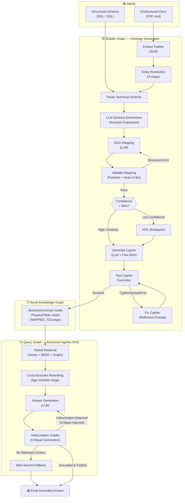
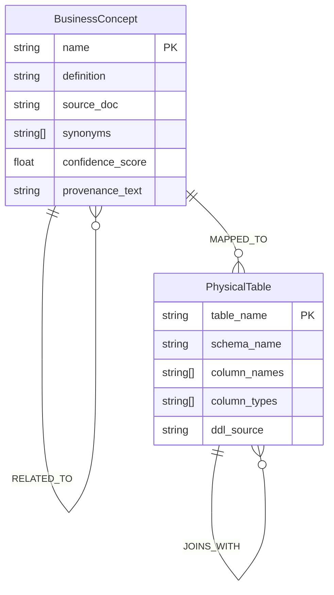
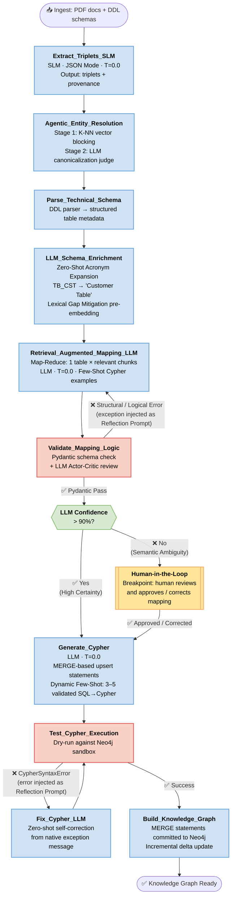
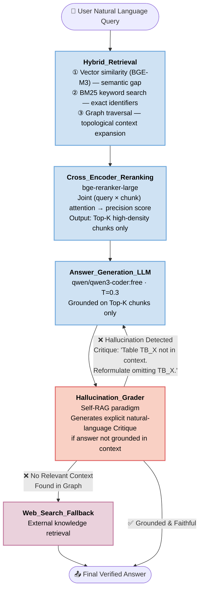
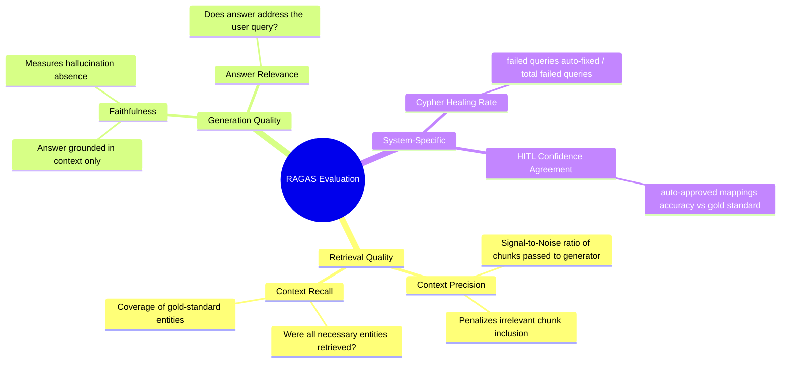
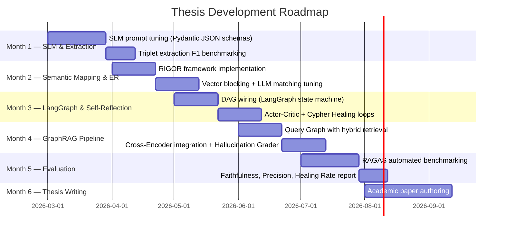
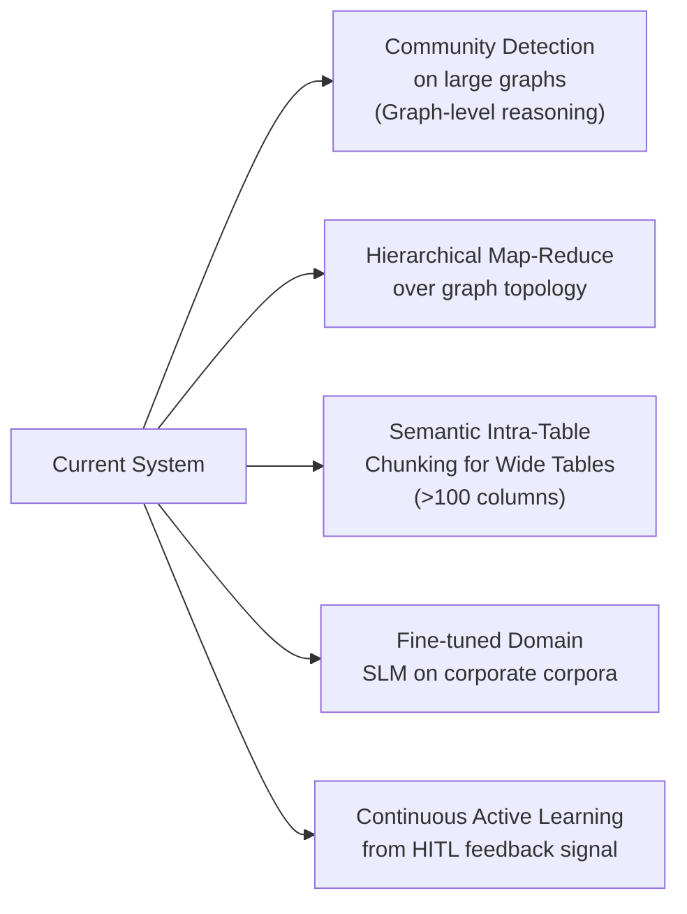

# Thesis Project: Multi-Agent Framework for Semantic Discovery & GraphRAG

> **Status:** In development — March 2026
> **Author:** Marc'Antonio Lopez
> **Scope:** Generative AI system for automated Data Governance via LangGraph-orchestrated multi-agent architecture.

---

## Table of Contents

1. [Abstract](#1-abstract)
2. [Architectural Vision](#2-architectural-vision)
3. [Tech Stack](#3-tech-stack)
4. [Flow 1 — Builder Graph (Ontology Construction)](#4-flow-1--builder-graph-ontology-construction)
5. [Flow 2 — Query Graph (Advanced Agentic RAG)](#5-flow-2--query-graph-advanced-agentic-rag)
6. [Prompting Strategies & Context Management](#6-prompting-strategies--context-management)
7. [Evaluation Framework (RAGAS)](#7-evaluation-framework-ragas)
8. [Development Roadmap](#8-development-roadmap)
9. [State-of-the-Art References](#9-state-of-the-art-references)
10. [Known Limits & Future Work](#10-known-limits--future-work)

---

## 1. Abstract

This thesis designs and implements a **Generative AI framework for Data Governance automation**. The system bridges the **semantic gap** between unstructured business documentation (PDF) and relational database schemas (DDL/SQL) by autonomously constructing a **Knowledge Graph on Neo4j**.

**Core innovations:**

| Innovation | Description |
|---|---|
| **Hybrid Ensemble** | SLM for structured extraction + frontier LLM for reasoning |
| **Self-Reflection Loops** | Actor-Critic validation + Cypher Healing (error injection → auto-fix) |
| **Advanced GraphRAG** | Critique-driven hallucination grading, no naive retry |
| **RIGOR paradigm** | Retrieval-Augmented Generation of Ontologies |

**Problem solved:** Feeding an entire SQL schema to a monolithic LLM causes Context Window Overload and hallucinations. This system decomposes the reasoning task into a **cognitive graph pipeline** with isolated, specialized nodes.

---

## 2. Architectural Vision

### 2.1 Paradigm Shift

```
Zero-Shot Monolithic Prompting  →  Agentic Workflow (LangGraph DAG)
Single LLM call on full schema  →  Specialized nodes, isolated context windows
No validation                   →  Self-reflection loops (Actor-Critic + Cypher Healing)
Static retrieval                →  Hybrid GraphRAG (Vector + BM25 + Graph Traversal)
```

### 2.2 High-Level System Architecture



### 2.3 Neo4j Ontology Meta-Model



**Key Cypher patterns (Upsert / MERGE strategy):**

```cypher
// Upsert a BusinessConcept
MERGE (bc:BusinessConcept {name: $name})
ON CREATE SET bc.definition = $definition, bc.provenance_text = $provenance
ON MATCH SET  bc.confidence_score = $confidence

// Upsert a PhysicalTable
MERGE (pt:PhysicalTable {table_name: $table_name})
ON CREATE SET pt.schema_name = $schema, pt.column_names = $columns

// Create semantic alignment
MATCH (bc:BusinessConcept {name: $concept})
MATCH (pt:PhysicalTable {table_name: $table})
MERGE (bc)-[:MAPPED_TO {confidence: $score, validated_by: $validator}]->(pt)
```

---

## 3. Tech Stack

### 3.1 Component Overview

| Layer | Component | Role |
|---|---|---|
| **Orchestration** | LangGraph | DAG state machine, conditional routing, checkpointing |
| **Chain Management** | LangChain | Prompt templates, chain composition, tool calling |
| **SLM Extraction** | `qwen/qwen3-next-80b-a3b-instruct:free` (OpenRouter) | Structured triplet extraction (JSON Mode only) |
| **LLM Reasoning** | `qwen/qwen3-coder:free` (OpenRouter) | Canonicalization, mapping, text-to-Cypher |
| **Dense Embeddings** | `BGE-M3` | Multilingual semantic embedding |
| **Reranking** | `bge-reranker-large` | Cross-Encoder scoring (query × chunk joint attention) |
| **Graph + Vector DB** | Neo4j | Hybrid: graph topology + vector index + BM25 |
| **Validation** | Pydantic v2 | Schema enforcement on LLM outputs |
| **Evaluation** | RAGAS | RAG quality metrics (faithfulness, recall, precision) |

### 3.2 Model Selection Rationale

| Model Role | Model | Why |
|---|---|---|
| Extraction (SLM) | `qwen/qwen3-next-80b-a3b-instruct:free` | Decoder-only, constrained JSON output, no reasoning overhead, bypasses NER taxonomy lock-in |
| Reasoning (LLM) | `qwen/qwen3-coder:free` | Strong instruction following, In-Context Learning, Cypher generation fidelity |
| Embeddings | `BGE-M3` | Multilingual, state-of-the-art dense retrieval, handles domain-specific vocabulary |
| Reranker | `bge-reranker-large` | Cross-Encoder: joint query+chunk attention → highest precision scoring |

### 3.3 LangGraph State Schema (conceptual)

```python
class BuilderState(TypedDict):
    # Inputs
    raw_documents: list[str]          # PDF chunks
    ddl_statements: list[str]         # SQL DDL

    # Extraction outputs
    triplets: list[Triplet]           # (subject, predicate, object, provenance)
    resolved_entities: list[Entity]   # post-Entity Resolution

    # Schema enrichment outputs
    table_schemas: list[TableSchema]  # parsed DDL output
    enriched_tables: list[EnrichedTableSchema]  # after LLM Schema Enrichment (enriched names/descriptions)

    # Mapping outputs
    mapping_proposals: list[Mapping]  # BusinessConcept -> PhysicalTable
    validation_errors: list[str]      # Pydantic / LLM critique feedback
    confidence_scores: dict[str, float]

    # Graph writing
    cypher_statements: list[str]
    cypher_errors: list[str]
    hitl_required: bool               # triggers Human-in-the-Loop breakpoint

class QueryState(TypedDict):
    user_query: str
    retrieved_chunks: list[Chunk]
    reranked_chunks: list[Chunk]
    generated_answer: str
    hallucination_critique: str | None
    iteration_count: int              # loop guard
    final_answer: str
```

---

## 4. Flow 1 — Builder Graph (Ontology Construction)

### 4.1 Agentic Workflow Diagram



### 4.2 Node Specifications

| Node | Model | T | Input | Output | Key Pattern |
|---|---|---|---|---|---|
| `Extract_Triplets_SLM` | `qwen/qwen3-next-80b-a3b-instruct:free` | 0.0 | PDF chunks | `(subject, predicate, object, provenance_text)` | JSON Mode + Data Provenance retention |
| `Agentic_Entity_Resolution` | BGE-M3 + LLM judge | — | raw triplets | canonical entities | Two-stage: K-NN blocking → LLM matching |
| `Parse_Technical_Schema` | deterministic parser | — | DDL SQL | structured table metadata | No LLM; pure parsing |
| `LLM_Schema_Enrichment` | `qwen/qwen3-coder:free` | 0.0 | raw table/column identifiers | enriched metadata (natural-language names + descriptions) | Zero-Shot Acronym Expansion; resolves Lexical Gap before embedding |
| `Retrieval_Augmented_Mapping_LLM` | `qwen/qwen3-coder:free` | 0.0 | 1 table + top-K chunks | `Mapping(concept, table, confidence)` | Map-Reduce per table, focused attention |
| `Validate_Mapping_Logic` | Pydantic v2 + LLM critic | 0.0 | mapping proposal | pass / error string | Actor-Critic: exception → Reflection Prompt |
| `Generate_Cypher` | `qwen/qwen3-coder:free` | 0.0 | validated mapping | MERGE Cypher string | Few-Shot (3–5 SQL→Cypher examples) |
| `Fix_Cypher_LLM` | `qwen/qwen3-coder:free` | 0.0 | Cypher + error | corrected Cypher | Zero-shot from native Neo4j exception |
| `Build_Knowledge_Graph` | — (Neo4j driver) | — | valid Cypher | graph commit | Upsert/MERGE strategy |

### 4.3 Self-Reflection Loop Detail

```mermaid
sequenceDiagram
    participant Actor as LLM Actor<br/>(Mapping / Cypher Gen)
    participant Validator as Critic / DB
    participant State as LangGraph State

    Actor->>Validator: Generated output (mapping / Cypher)
    Validator-->>State: ❌ Error / Critique message

    Note over State: Exception string appended to state.validation_errors
    State->>Actor: Reflection Prompt:<br/>"Previous attempt failed with: {error}.<br/>Fix and regenerate."

    Actor->>Validator: Corrected output
    Validator-->>State: ✅ Pass
    State->>State: Clear error buffer, advance node
```

**Reflection Prompt Template:**

```
System: You are a strict {role}. Return only valid {format}. No explanations.

Previous attempt produced this error:
<error>
{native_exception_message}
</error>

Original input:
<input>
{original_input}
</input>

Regenerate a corrected {format} that resolves the error above.
```

### 4.4 Incremental Graph Update (Upsert Strategy)

> **Key design decision:** The graph is **never rebuilt from scratch**. Every write uses `MERGE` (upsert semantics). The LLM only processes the **delta** (new/changed documents or tables), not the full corpus.

**Benefits:**
- Drastically reduces inference cost on updates
- Enables Continuous Learning / live schema evolution
- Prevents duplicate nodes on re-ingestion

---

## 5. Flow 2 — Query Graph (Advanced Agentic RAG)

### 5.1 Workflow Diagram



### 5.2 Hybrid Retrieval — Mechanism Breakdown

| Retrieval Method | What It Captures | Failure Mode Addressed |
|---|---|---|
| **Dense Vector** (BGE-M3) | Semantic similarity, paraphrases | Lexical Gap (synonym mismatch) |
| **BM25 Keyword** | Exact string matches (table IDs, codes) | Embedding dilution on rare tokens |
| **Graph Traversal** | Topological neighbours, related concepts | Isolated chunk missing relational context |

> All three results are merged → fed to **Cross-Encoder** which jointly scores each `(query, chunk)` pair through full transformer attention layers → only **Top-K** chunks pass to generation.

### 5.3 Hallucination Grader — Critique Protocol

```
Grader System Prompt:
You are a strict factual auditor. Given a context and a generated answer,
identify any claims in the answer NOT supported by the context.

If hallucinations are found, output a Critique in this exact JSON format:
{
  "grounded": false,
  "critique": "<natural-language explanation of what is unsupported, naming specific entities>",
  "action": "regenerate"  // or "web_search" if context is entirely irrelevant
}

If the answer is fully grounded:
{
  "grounded": true,
  "critique": null,
  "action": "pass"
}
```

**Loop guard:** `iteration_count` in state caps regeneration attempts (default: 3) before forcing a fallback.

---

## 6. Prompting Strategies & Context Management

### 6.1 Per-Node Prompt Configuration

| Node | Persona (System Prompt) | Technique | Temperature |
|---|---|---|---|
| `Extract_Triplets_SLM` | "Strict information extractor. Output only valid JSON." | JSON Mode + Pydantic schema | 0.0 |
| `Agentic_Entity_Resolution` | "Semantic judge. Determine canonical entity identity." | Few-Shot + provenance injection | 0.0 |
| `LLM_Schema_Enrichment` | "You are a database naming expert. Expand abbreviated table and column identifiers into precise, human-readable English names." | Zero-Shot, structured JSON output | 0.0 |
| `Retrieval_Augmented_Mapping_LLM` | "Data governance expert mapping business concepts to tables." | Map-Reduce, RAG context, Few-Shot | 0.0 |
| `Validate_Mapping_Logic` | "Strict Cypher validator. Return only code. No explanations." | Reflection Prompt on failure | 0.0 |
| `Generate_Cypher` | "Neo4j Cypher expert. Use MERGE for all writes." | Dynamic Few-Shot (3–5 examples) | 0.0 |
| `Fix_Cypher_LLM` | "Debug and fix the Cypher error. Return only corrected code." | Exception injection | 0.0 |
| `Answer_Generation_LLM` | "Precise data analyst. Answer only from provided context." | Grounding constraint + Critique injection | 0.3 |
| `Hallucination_Grader` | "Strict factual auditor. Identify unsupported claims." | Self-RAG critique JSON output | 0.0 |

### 6.2 Few-Shot Example Template (Cypher Generation Node)

```
Here are {n} validated mapping examples:

Example 1:
SQL Table: CUSTOMER (CUST_ID INT, NAME VARCHAR, REGION_CODE VARCHAR)
Business Concept: "Customer" — an entity that purchases goods or services
Cypher:
MERGE (bc:BusinessConcept {name: "Customer"})
MERGE (pt:PhysicalTable {table_name: "CUSTOMER"})
MERGE (bc)-[:MAPPED_TO {confidence: 0.97}]->(pt)

Example 2:
...

Now generate Cypher for the following:
SQL Table: {table_ddl}
Business Concept: {concept_name} — {concept_definition}
```

### 6.3 Temperature Strategy Summary

$$
T_{extraction} = 0.0 \quad \text{(deterministic, structured output)}
$$
$$
T_{reasoning} = 0.0 \quad \text{(precise mapping and code generation)}
$$
$$
T_{generation} = 0.3 \quad \text{(natural language fluency for user-facing answers)}
$$

---

## 7. Evaluation Framework (RAGAS)

### 7.1 Metrics Overview



### 7.2 Metric Definitions

| Metric | Formula / Definition | Target | Validates |
|---|---|---|---|
| **Context Precision** | $\frac{\|\text{relevant chunks in Top-K}\|}{\|\text{Top-K}\|}$ | > 0.85 | Reranker quality |
| **Context Recall** | $\frac{\|\text{retrieved gold entities}\|}{\|\text{all gold entities}\|}$ | > 0.90 | Hybrid Retrieval coverage |
| **Faithfulness** | $\frac{\|\text{claims supported by context}\|}{\|\text{total claims in answer}\|}$ | > 0.95 | Hallucination Grader effectiveness |
| **Cypher Healing Rate** | $\frac{\|\text{queries self-fixed by LLM}\|}{\|\text{total failed queries}\|}$ | > 0.80 | Self-reflection loop (Cypher) |
| **HITL Confidence Agreement** | $\text{corr}(\text{auto-approved}, \text{gold accuracy})$ | > 0.90 | Confidence threshold calibration |

### 7.3 Evaluation Dataset Strategy

- **Synthetic ground truth:** Generate `(question, expected_answer, gold_context_chunks)` triples from known schema+doc pairs
- **Benchmark splits:** Extraction F1, Mapping accuracy (concept↔table), Cypher correctness, Answer faithfulness
- **Automated RAGAS pipeline:** Runs after each development milestone (months 1–5)

---

## 8. Development Roadmap



### 8.1 Milestone Summary

| Month | Focus | Key Deliverable | Success Metric |
|---|---|---|---|
| 1 | SLM Setup & Extraction | Triplet extractor with Pydantic schemas | F1-Score on triplet extraction |
| 2 | Semantic Mapping & ER | RIGOR framework + Entity Resolution | ER precision/recall on business corpus |
| 3 | LangGraph Orchestration | Full Builder Graph DAG | Cypher Healing Rate > 80% |
| 4 | Advanced GraphRAG | Query Graph with Hallucination Grader | Faithfulness > 95% |
| 5 | RAGAS Evaluation | Full benchmark report | All metrics above target |
| 6 | Thesis Writing | Academic paper | Submission |

---

## 9. State-of-the-Art References

| Reference | Topic | Source |
|---|---|---|
| **RIGOR** | Retrieval-Augmented Generation of Ontologies for relational schemas | arXiv:2506.01232 |
| **SLM Structured Extraction** | Decoder-only SLMs for constrained JSON generation, bypassing NER taxonomy lock-in | 2025 SOTA literature |
| **Self-RAG** | Models capable of self-evaluation and explicit critique generation | Self-RAG paper + extensions |
| **BGE-M3** | Multilingual dense retrieval, multi-granularity | BAAI/BGE-M3 |
| **bge-reranker-large** | Cross-Encoder joint attention reranking | BAAI |
| **Agentic Entity Resolution** | Two-phase: vector blocking (K-NN) + LLM matching judge | 2025 SOTA |
| **RAGAS** | Automated RAG evaluation framework | ragas.io |

---

## 10. Known Limits & Future Work

### 10.1 Current Limitations

| Limitation | Description | Impact |
|---|---|---|
| **Multi-Hop Reasoning** | Global graph reasoning over 1000+ tables exceeds output token limits and reasoning depth | Cannot summarize full DB topology in one pass |
| **Wide Tables** | Denormalized tables with >100 columns push LLM attention mechanisms past effective range | Mapping quality degrades on dense schemas |
| **Self-Correction Ceiling** | Reflection loops may fail to fix semantically ambiguous errors (not just syntactic) | Requires HITL fallback for complex cases |
| **Embedding Drift** | BGE-M3 embeddings may degrade on highly domain-specific jargon not in training corpus | Semantic retrieval may miss niche terminology |

### 10.2 Future Research Directions



| Research Direction | Addresses | Approach |
|---|---|---|
| **Community Detection** | Multi-Hop global reasoning | Graph algorithms (Louvain, etc.) to partition and summarise sub-graphs |
| **Hierarchical Map-Reduce** | Large schema summarization | Recursive LLM passes over graph communities |
| **Semantic Intra-Table Chunking** | Wide tables (>100 cols) | Column clustering by semantic similarity before LLM attention |
| **Domain SLM Fine-Tuning** | Embedding drift on jargon | LoRA fine-tune on corporate documentation |
| **Active HITL Learning** | Model calibration | Use human corrections as few-shot examples in subsequent runs |