# Component Architecture Diagrams

All Mermaid diagrams for internal component architectures.

---

## 02 - Configuration System

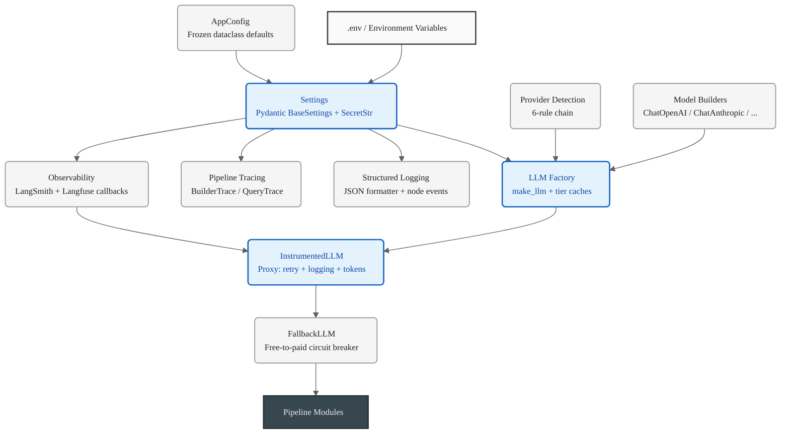

---

## 03 - Data Models

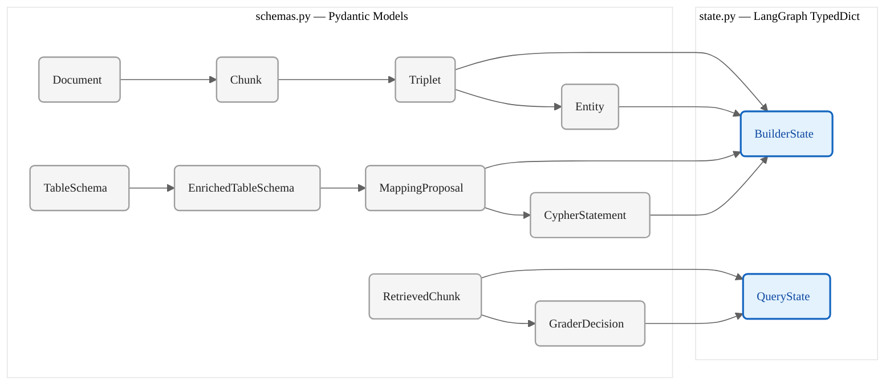

---

## 04 - Prompt Engineering

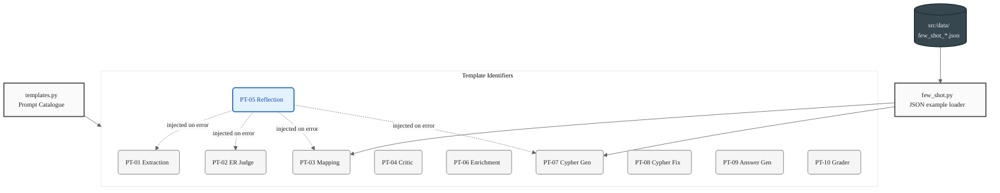

---

## 05 - Utilities

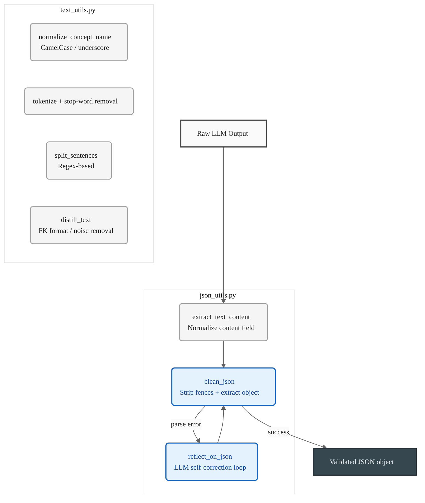

---

## 06 - Ingestion

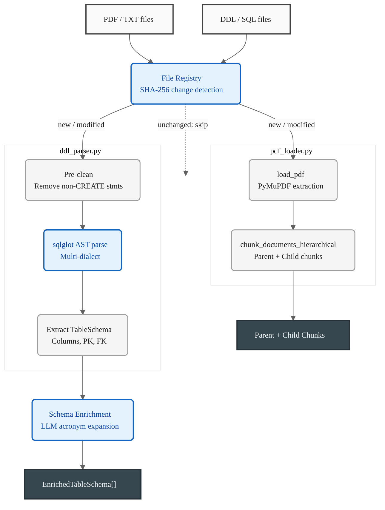

---

## 07 - Triplet Extraction

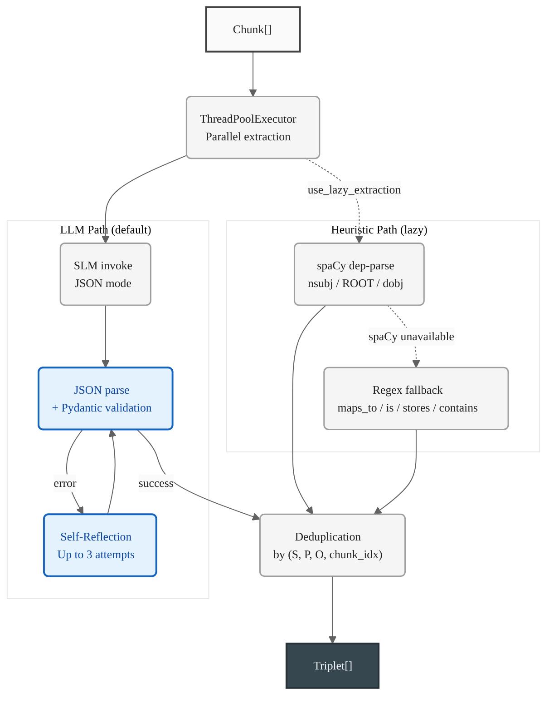

---

## 08 - Entity Resolution

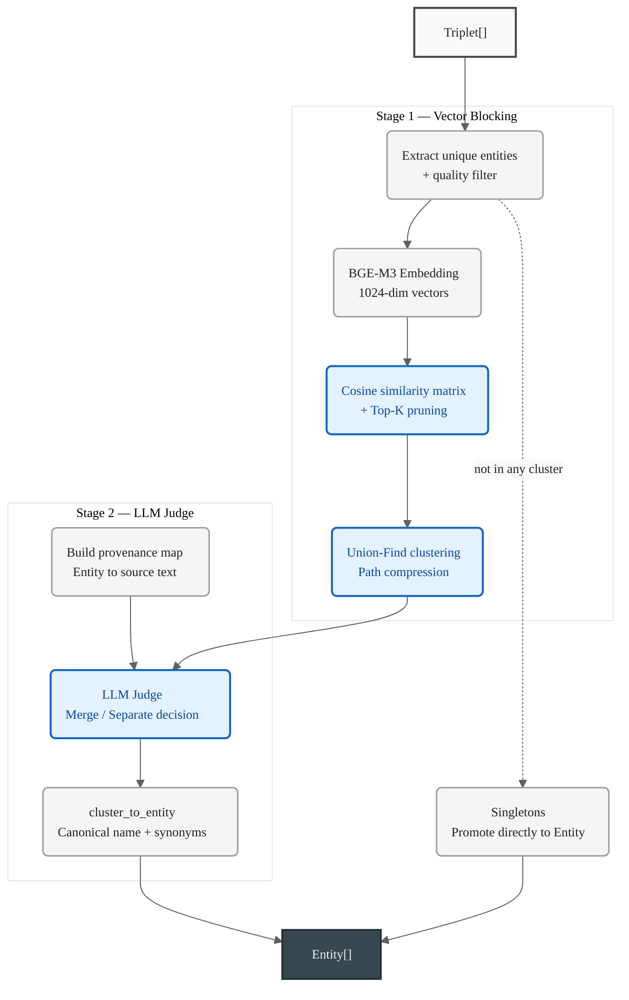

---

## 09 - RAG Mapping + Validation

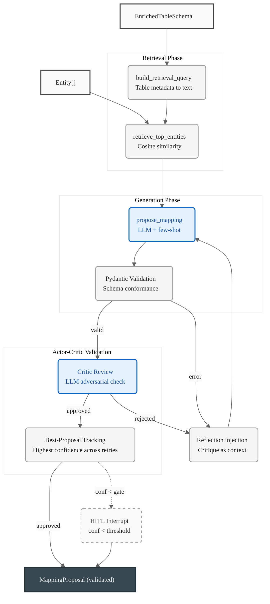

---

## 10 - Graph Construction

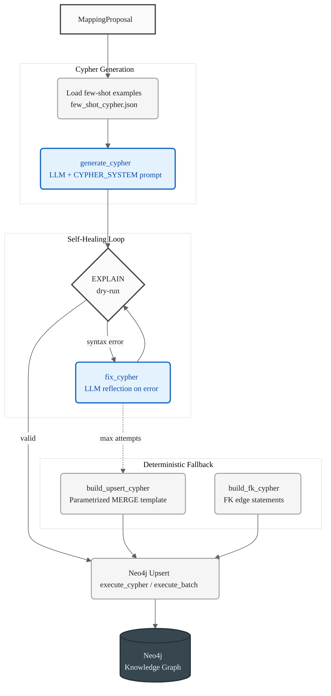

---

## 11 - Retrieval

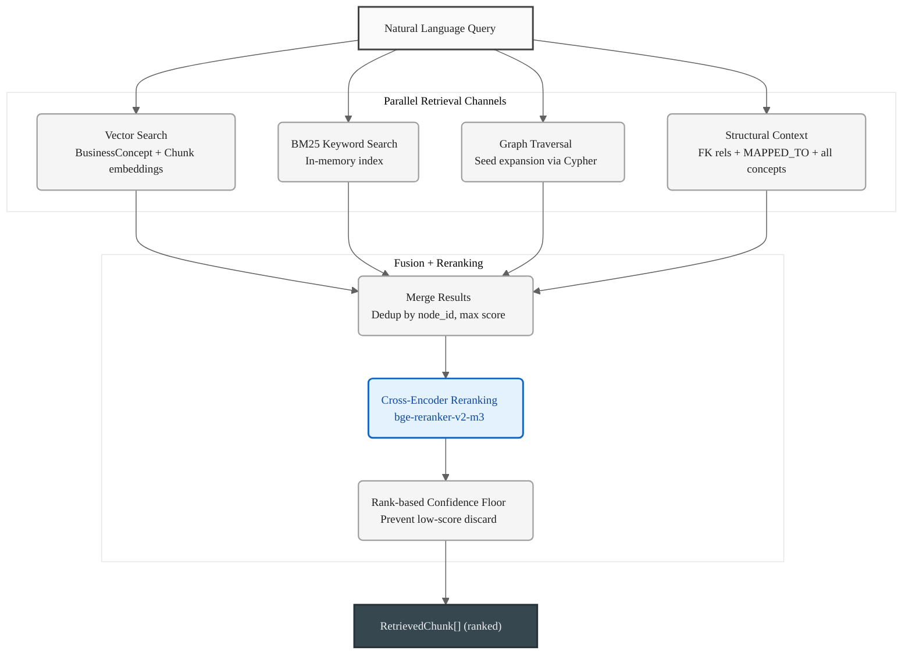

---

## 12 - Answer Generation + Grading

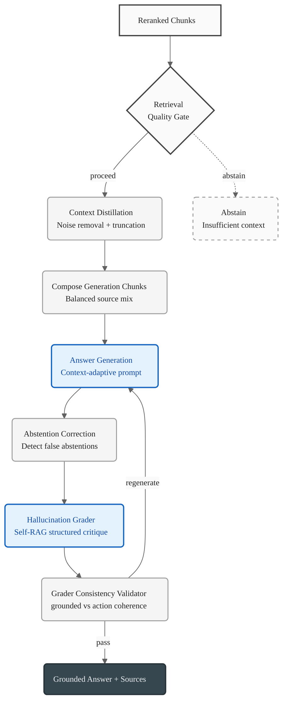

---

## 13 - REST API

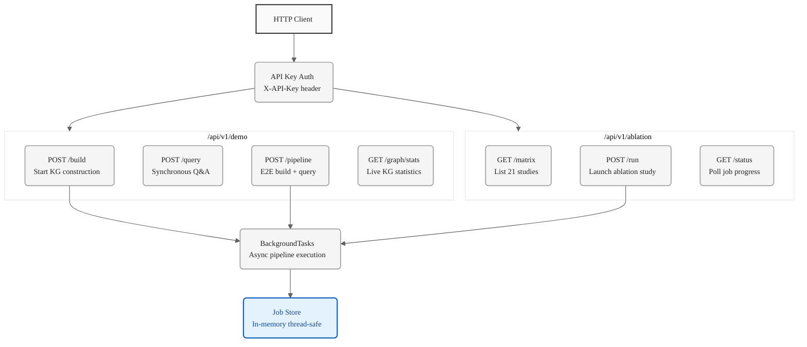

---

## 14 - Evaluation

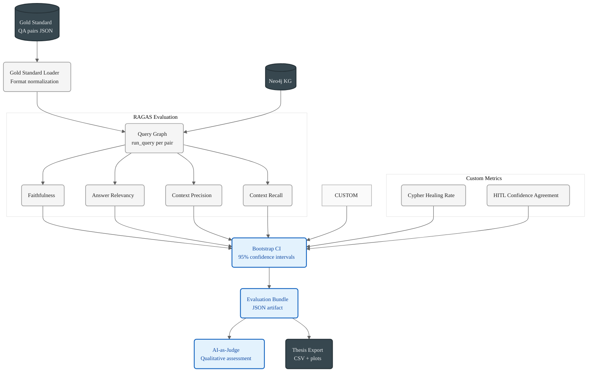

---

## 15 - Ablation Framework

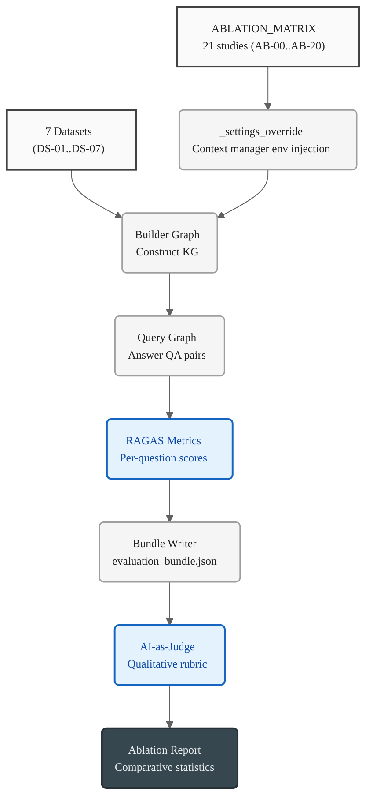
