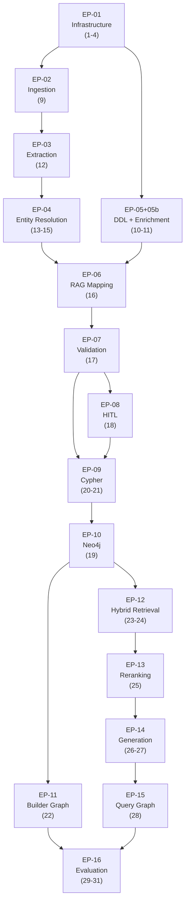

# Implementation Guide — Zero to Hero

> **Project:** Multi-Agent Framework for Semantic Discovery & GraphRAG  
> **Author:** Marc'Antonio Lopez  
> **Status:** Ready for implementation — March 2026

This folder contains one Markdown guide per source file, written as **zero-to-hero references**: each guide provides the complete Python implementation, the corresponding pytest code, and enough context to implement the file without consulting any other document.

---

## Reading Order

Follow the numbered order below. Each guide lists its **prerequisites** so you always know what must exist before you start.

| # | File to implement | Guide | Epic |
|---|---|---|---|
| 1 | `pyproject.toml` + `.env.example` | [01-pyproject.md](part-1-infrastructure/01-pyproject.md) | EP-01 |
| 2 | `src/config/settings.py` | [02-settings.md](part-1-infrastructure/02-settings.md) | EP-01 |
| 3 | `src/config/logging.py` | [03-logging.md](part-1-infrastructure/03-logging.md) | EP-01 |
| 4 | `src/config/llm_factory.py` | [04-llm-factory.md](part-1-infrastructure/04-llm-factory.md) | EP-01 |
| 4b | `src/config/llm_client.py` | [04b-llm-client.md](part-1-infrastructure/04b-llm-client.md) | EP-01 |
| 5 | `src/models/schemas.py` | [05-schemas.md](part-2-models-prompts/05-schemas.md) | EP-06 data models |
| 6 | `src/models/state.py` | [06-state.md](part-2-models-prompts/06-state.md) | EP-11, EP-15 |
| 7 | `src/prompts/templates.py` | [07-templates.md](part-2-models-prompts/07-templates.md) | EP-07 prompts |
| 8 | `src/prompts/few_shot.py` | [08-few-shot.md](part-2-models-prompts/08-few-shot.md) | EP-06, EP-09 |
| 9 | `src/ingestion/pdf_loader.py` | [09-pdf-loader.md](part-3-ingestion/09-pdf-loader.md) | EP-02 |
| 10 | `src/ingestion/ddl_parser.py` | [10-ddl-parser.md](part-3-ingestion/10-ddl-parser.md) | EP-05 |
| 11 | `src/ingestion/schema_enricher.py` | [11-schema-enricher.md](part-3-ingestion/11-schema-enricher.md) | EP-05b |
| 12 | `src/extraction/triplet_extractor.py` | [12-triplet-extractor.md](part-4-extraction-er/12-triplet-extractor.md) | EP-03 |
| 13 | `src/resolution/blocking.py` | [13-blocking.md](part-4-extraction-er/13-blocking.md) | EP-04 stage 1 |
| 14 | `src/resolution/llm_judge.py` | [14-llm-judge.md](part-4-extraction-er/14-llm-judge.md) | EP-04 stage 2 |
| 15 | `src/resolution/entity_resolver.py` | [15-entity-resolver.md](part-4-extraction-er/15-entity-resolver.md) | EP-04 |
| 16 | `src/mapping/rag_mapper.py` | [16-rag-mapper.md](part-5-mapping/16-rag-mapper.md) | EP-06 |
| 17 | `src/mapping/validator.py` | [17-validator.md](part-5-mapping/17-validator.md) | EP-07 |
| 18 | `src/mapping/hitl.py` | [18-hitl.md](part-5-mapping/18-hitl.md) | EP-08 |
| 19 | `src/graph/neo4j_client.py` | [19-neo4j-client.md](part-6-graph/19-neo4j-client.md) | EP-10 |
| 20 | `src/graph/cypher_generator.py` | [20-cypher-generator.md](part-6-graph/20-cypher-generator.md) | EP-09 |
| 21 | `src/graph/cypher_healer.py` | [21-cypher-healer.md](part-6-graph/21-cypher-healer.md) | EP-09 |
| 22 | `src/graph/builder_graph.py` | [22-builder-graph.md](part-6-graph/22-builder-graph.md) | EP-11 |
| 23 | `src/retrieval/embeddings.py` | [23-embeddings.md](part-7-retrieval/23-embeddings.md) | EP-12 |
| 24 | `src/retrieval/hybrid_retriever.py` | [24-hybrid-retriever.md](part-7-retrieval/24-hybrid-retriever.md) | EP-12 |
| 25 | `src/retrieval/reranker.py` | [25-reranker.md](part-7-retrieval/25-reranker.md) | EP-13 |
| 26 | `src/generation/answer_generator.py` | [26-answer-generator.md](part-8-generation/26-answer-generator.md) | EP-14 |
| 27 | `src/generation/hallucination_grader.py` | [27-hallucination-grader.md](part-8-generation/27-hallucination-grader.md) | EP-14 |
| 28 | `src/generation/query_graph.py` | [28-query-graph.md](part-8-generation/28-query-graph.md) | EP-15 |
| 29 | `src/evaluation/ragas_runner.py` | [29-ragas-runner.md](part-9-evaluation/29-ragas-runner.md) | EP-16 |
| 30 | `src/evaluation/custom_metrics.py` | [30-custom-metrics.md](part-9-evaluation/30-custom-metrics.md) | EP-16 |
| 31 | `src/evaluation/ablation_runner.py` | [31-ablation-runner.md](part-9-evaluation/31-ablation-runner.md) | EP-16 |

---

## Dependency Graph



---

## Guide Structure

Every guide in this folder follows the same 6-section template:

```
## 1. Purpose & Context       — which epic, why this file exists
## 2. Prerequisites           — what must already be implemented
## 3. Public API              — function/class signatures table
## 4. Full Implementation     — complete, copy-pasteable Python code
## 5. Tests                   — complete pytest code for the corresponding test file
## 6. Smoke Test              — quick shell command to verify it works
```

---

## Conventions Applied Throughout

| Convention | Rule |
|---|---|
| **Temperature** | `0.0` for all extraction/mapping/grading nodes; `0.3` for `answer_generator` only |
| **LLM writes** | Always `MERGE`, never bare `CREATE` |
| **Error handling** | Per-item catch + log + skip; never crash the pipeline |
| **Prompts** | Always imported from `src/prompts/templates.py`; never inlined |
| **Settings** | Always from `src/config/settings.py`; never hardcoded |
| **Logging** | Always `get_logger(__name__)`; never `print()` |
| **Type annotations** | Full annotations on all public functions; `mypy --strict` must pass |
| **HITL checkpointing** | `MemorySaver` in dev; `SqliteSaver` for production-like runs |

---

## Environment Setup (do once before starting)

```bash
# 1. Copy env file
cp .env.example .env
# Edit .env with your Neo4j password and LLM endpoint

# 2. Install all dependencies
pip install -e ".[dev]"

# 3. Start Neo4j (Docker)
docker run -d \
  --name neo4j-thesis \
  -p 7474:7474 -p 7687:7687 \
  -e NEO4J_AUTH=neo4j/your_password_here \
  neo4j:5

# 4. Thesis LLM setup — OpenRouter Free Tier (zero cost, no local GPU required)
#    Get your API key at https://openrouter.ai/keys then add to .env:
#    OPENROUTER_API_KEY=sk-or-v1-...
#    LLM_MODEL_REASONING=qwen/qwen3-coder:free
#    LLM_MODEL_EXTRACTION=qwen/qwen3-next-80b-a3b-instruct:free
#
#    Architecture: swap model slugs in .env, or replace ChatOpenRouter in
#    src/config/llm_factory.py with ChatOpenAI / ChatAnthropic / ChatOllama.

# 5. Run the test suite (unit tests only, no Neo4j needed)
pytest tests/unit/ -v
```
